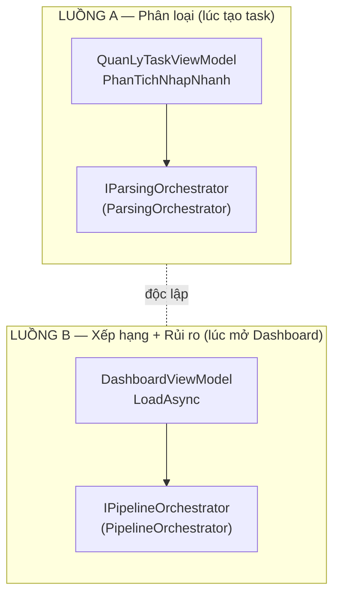
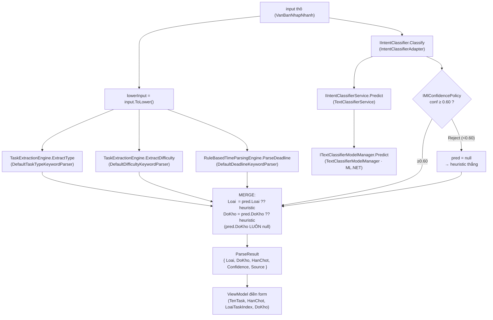
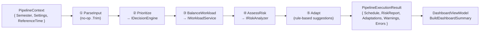
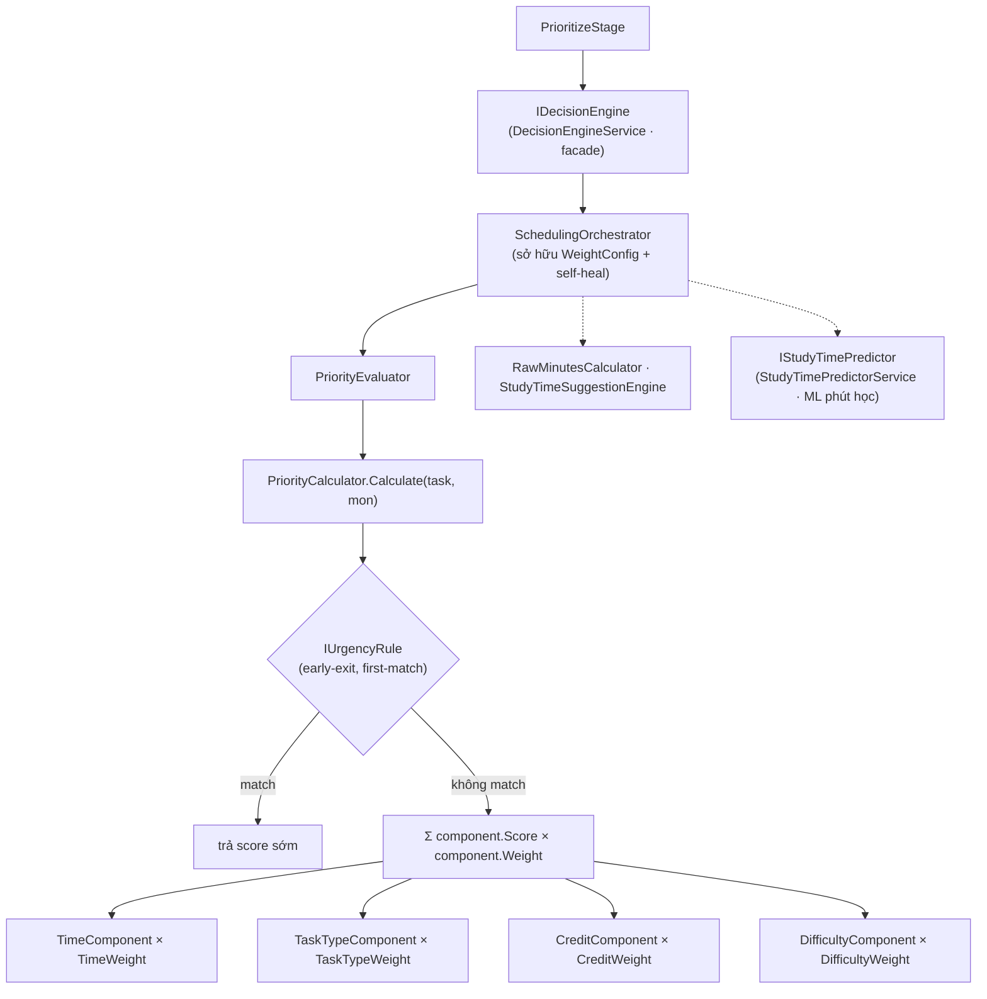
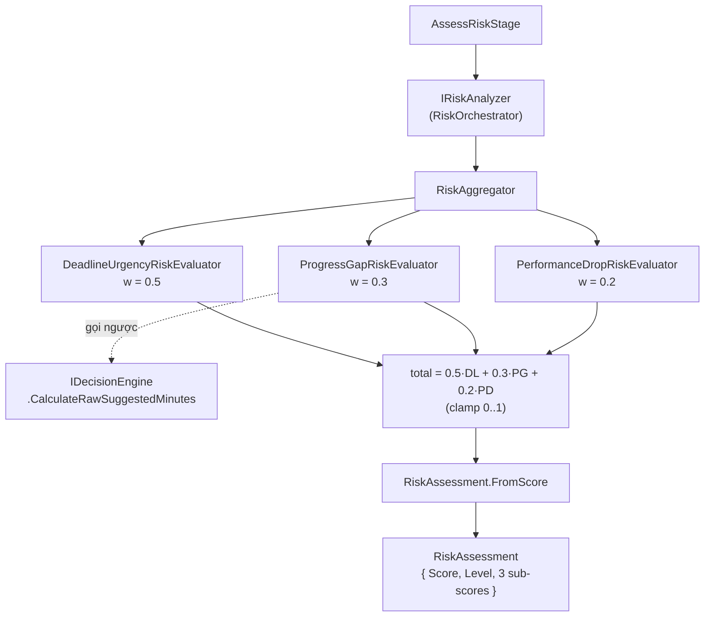
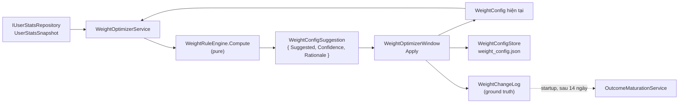

# Pipeline: Phân loại & Xếp hạng Task

> **Mô tả (descriptive)** — viết 2026-06-10 từ code thực thi (sau khi retire
> `RiskAnalyzerService`, commit `0346637`, và static `SmartParser`, commit `222cb5a`);
> rà lại 2026-07-01; rà lại lần cuối **2026-07-07 tại commit `3c96978`** (nhánh `ui_rf`). Theo [`../plans/2026-07-01-architecture-direction-decisions.md`](../plans/2026-07-01-architecture-direction-decisions.md)
> (D-C), **code là chuẩn — file này có thể lag so với code.** Đây vẫn là bản mô tả chi tiết
> nhất cho luồng **phân loại task** và **xếp hạng + rủi ro**.

## 1. Hai luồng độc lập (đừng nhầm)

Hệ thống có **2 luồng riêng biệt, kích hoạt từ 2 nơi khác nhau**. Tên gọi dễ trùng nên cần phân định rõ ngay từ đầu:

| Luồng | Kích hoạt khi | Entry point | Việc chính |
|---|---|---|---|
| **A — Phân loại** | Người dùng **tạo task** (nhập nhanh) | `QuanLyTaskViewModel.PhanTichNhapNhanh` → `IParsingOrchestrator.Parse` | Đoán Loại / Độ khó / Hạn chót từ câu chữ |
| **B — Xếp hạng + Rủi ro** | Mở **Dashboard** | `DashboardViewModel.LoadAsync` → `IPipelineOrchestrator.Execute` | Tính điểm ưu tiên, sắp xếp, đánh giá rủi ro, gợi ý điều chỉnh |

> ⚠️ `ParseInputStage` **bên trong** pipeline (luồng B) **KHÔNG** phải engine phân loại — nó chỉ
> là no-op chuẩn hóa (`RawInput.Trim()`, đặt `ParsedTaskCount = 1`). Toàn bộ "phân loại task"
> thật nằm ở **luồng A** (`ParsingOrchestrator`).



---

## 2. LUỒNG A — Hệ thống phân loại task

`Core/Parsing/Orchestrators/ParsingOrchestrator.cs` điều phối: **heuristic chạy trước, ML augment sau qua confidence gate**. Triết lý: ML là *enhancement*, không bao giờ làm vỡ parsing (offline-first).



### 2.1 Heuristic engines (rule-based, luôn chạy)

| Field | File | Logic |
|---|---|---|
| **Loại task** | `Services/Strategies/ITaskTypeKeywordParser.cs` (`DefaultTaskTypeKeywordParser`) | first-match-wins: `giữa kỳ/gk`→ThiGiuaKy · `cuối kỳ/ck`→ThiCuoiKy · `đồ án/btl/project`→DoAnCuoiKy · `kiểm tra/test/15p`→KiemTraThuongXuyen · mặc định **BaiTapVeNha** |
| **Độ khó** | `Services/Strategies/IDifficultyKeywordParser.cs` | `khó/căng/chết`→5 · `dễ/chill/ez`→1 · mặc định **3** |
| **Hạn chót** | `Services/Strategies/IDeadlineKeywordParser.cs` | 2 phase: relative (`hôm nay/mai/mốt/tuần sau`) → override bằng thứ trong tuần (`thứ 2…chủ nhật`); `"tuần sau" + "thứ X"` = +7 ngày; mặc định `now+1` |

`TaskExtractionEngine` (`Core/Parsing/Engines/`) compose 2 parser type+difficulty;
`RuleBasedTimeParsingEngine` wrap parser deadline.

### 2.2 ML engine (M8-A) — chỉ ảnh hưởng **Loại task**

```
IIntentClassifier (IntentClassifierAdapter.cs)
  └─ IIntentClassifierService (TextClassifierService.cs)   → DoKho LUÔN = null
       └─ ITextClassifierModelManager (TextClassifierModelManager.cs)  ← ML.NET multiclass
```

- **Model** (`TextClassifierModelManager.cs`): pipeline ML.NET
  `MapValueToKey → FeaturizeText → SdcaMaximumEntropy → MapKeyToValue`. Offline-first: nếu chưa có
  `text_classifier.zip` thì tự train từ seed CSV nhúng (`seed_intents.csv`), atomic temp-swap, có
  seed-version gate (SHA-256) để retrain khi seed đổi (v2→v3). PredictionEngine tạo mới mỗi lần gọi
  (không thread-safe, chấp nhận cho MVP).
- **Confidence gate** (`DefaultMlConfidencePolicy.cs`): `≥0.75 AutoApply` / `0.60–0.75 Review` /
  `<0.60 Reject`. `IntentClassifierAdapter` coi mọi thứ **khác Reject** là "merge"; dự đoán dưới 0.60
  bị bỏ → heuristic thắng. Mọi exception bị nuốt → trả `null`.

> **Tóm tắt trung thực:** *ML chỉ phân loại Loại task. Độ khó và Hạn chót luôn rule-based.
> ML chỉ ghi đè heuristic khi confidence ≥ 0.60.* `ParseSource` ghi lại nguồn quyết định
> (enum khai báo `Heuristic` / `MlAugmented` / `MlOverridden`, nhưng orchestrator hiện **chỉ set `Heuristic` và `MlAugmented`** — `MlOverridden` khai báo sẵn, chưa được dùng) để UI hiển thị "AI gợi ý… hãy kiểm tra lại".

---

## 3. LUỒNG B — Pipeline (Dashboard)

`Services/Pipeline/PipelineOrchestrator.cs` chạy các stage theo `Order` cố định; mỗi stage có
`CanRun` (skip policy) + đo `Stopwatch`; **fail-fast** khi một stage lỗi. State chảy qua
`PipelineContext` (mutable), kết quả gom vào `PipelineExecutionResult`.



Thứ tự enum `PipelineStageType`: `ParseInput(0) → Prioritize(1) → BalanceWorkload(2) → AssessRisk(3) → Adapt(4)`.

### 3.1 Stage Prioritize — Hệ thống **xếp hạng task**

`PrioritizeStage.cs`: với mỗi task **chưa hoàn thành**, gọi `IDecisionEngine.CalculatePriority(task, mon)`
gán vào `task.DiemUuTien`, rồi **`OrderByDescending(DiemUuTien)`** → đây chính là thứ hạng.



**Urgency rules** (`Services/Strategies/IUrgencyRule.cs`) — chạy trước, thoát sớm:

| Rule | Điều kiện | Điểm |
|---|---|---|
| `OverdueRule` | `daysLeft < -3` | 0 (quá hạn lâu, bỏ) |
| `JustOverdueRule` | `daysLeft < 0` | 100 (vừa quá hạn, kịch trần) |
| `ImminentRule` | `daysLeft < 1` | 95 (sát hạn) |
| `CompletedRule` | đã hoàn thành | 0 |
| `BeyondHorizonRule` | `daysLeft > HorizonDays` | 1 (quá xa) |

**Weighted components** (`Services/Strategies/IPriorityComponent.cs`) — nếu không rule nào match:

| Component | Score (0–100) | Weight (mặc định) |
|---|---|---|
| `TimeComponent` | `100·(1 − daysLeft/Horizon)` | `TimeWeight` **0.40** |
| `TaskTypeComponent` | `provider.GetWeight(Loai)·100` | `TaskTypeWeight` **0.30** |
| `CreditComponent` | `(SoTinChi/MaxCredits)·100` | `CreditWeight` **0.20** |
| `DifficultyComponent` | `(DoKho/MaxDifficulty)·100` | `DifficultyWeight` **0.10** |

`ITaskTypeWeightProvider.cs` (`DefaultTaskTypeWeightProvider`): ThiCuoiKy 1.0 > DoAnCuoiKy 0.8 >
ThiGiuaKy 0.6 > KiemTra 0.3 > BaiTapVeNha 0.1.

`WeightConfig.cs`: 4 trọng số mặc định cộng = 1.0. `IsValid()` (tổng ≈ 1.0, sai số 0.001) được
`SchedulingOrchestrator.CalculatePriority` kiểm; nếu hỏng → reset default (**self-heal**). `Normalize()`
clamp sàn `MinWeight = 0.05` rồi scale về 1.0 (guardrail sau khi WeightOptimizer chỉnh).
Singleton `WeightConfig` được **nạp từ đĩa** lúc composition (`WeightConfigStore.Load()` →
`%LocalAppData%\SmartStudyPlanner\weight_config.json`, `Services/ServiceLocator.cs:67`) và được
ghi lại khi user Apply gợi ý ở `WeightOptimizerWindow` — trọng số sống sót qua restart.

> Rule precedence kiểm `Overdue/JustOverdue/Imminent` **trước** `CompletedRule`, nhưng trong luồng
> pipeline vô hại vì `PrioritizeStage` đã lọc task hoàn thành trước khi gọi.

### 3.2 Stage AssessRisk — Hệ thống **phân loại mức rủi ro**

`AssessRiskStage.cs` gọi `IRiskAnalyzer.Assess` cho từng task chưa xong.



Mỗi evaluator (`Core/Risk/Evaluators/`) trả `[0,1]`:

- **DeadlineUrgency**: quá hạn → 1.0; ngược lại `1/(daysLeft+1)`.
- **ProgressGap**: `1 − min(1, ThoiGianDaHoc / RawSuggestedMinutes)` — **phụ thuộc Scheduling** (gọi
  ngược `IDecisionEngine.CalculateRawSuggestedMinutes`).
- **PerformanceDrop**: `(DoKho−1)/(5−1)` — càng khó càng rủi ro.

**Phân loại mức** — `Core/Risk/Models/RiskAssessment.cs` (`FromScore`):

| Score | Level | Nhãn UI |
|---|---|---|
| ≥ 0.8 | `Critical` | ⚠️ Khẩn cấp |
| ≥ 0.6 | `High` | 🔴 Nguy cơ cao |
| ≥ 0.3 | `Medium` | 🟡 Chú ý |
| còn lại | `Low` | 🟢 An toàn |

> **Lưu ý:** Dashboard còn một bộ nhãn **thứ hai, độc lập**, dựa trên *điểm ưu tiên* chứ không phải
> điểm rủi ro: `DashboardViewModel.GetWarningLevel` → `DiemUuTien ≥80` "Khẩn cấp", `≥50` "Chú ý",
> còn lại "An toàn". Đừng nhầm hai bộ nhãn này.

### 3.3 Stage BalanceWorkload & Adapt

- **BalanceWorkload** (`BalanceWorkloadStage.cs`): ủy quyền cho
  `IWorkloadService.GenerateSchedule(semester, capacity)` (`WorkloadServiceImpl.cs`). *Nằm ngoài
  trọng tâm phân loại/xếp hạng — xem riêng nếu cần.*
- **Adapt** (`AdaptStage.cs`): rule-based thuần, **không mutate domain**, chỉ sinh
  `AdaptationSuggestion`. So sánh tiến độ thực tế vs kỳ vọng (theo lịch học kỳ): `progress + 0.05 <
  expected` → gợi ý tăng priority (+0.1); hoàn thành 100% môn → gợi ý giảm workload (−0.1).

---

## 4. Vòng feedback — WeightOptimizer (M8-B, UI Slice 8 ĐÃ SHIP)

`Services/ML/WeightOptimizer/` — engine **read-only, không tự apply**; việc apply do UI Slice 8
(`WeightOptimizerWindow`) đảm nhiệm:

- `WeightOptimizerService.cs`: async wrapper, fetch `UserStatsSnapshot` từ `IUserStatsRepository`.
- `WeightRuleEngine.cs`: hàm thuần, deterministic, không I/O. `pressure = 0.6·missRate +
  0.4·delayNorm`, giảm theo `FocusStreakDays`, dịch tối đa `MaxShift = 0.15` về `TimeWeight` (rút tỉ
  lệ từ 3 trọng số còn lại), rồi `Normalize()`. `Confidence` = độ *đủ* dữ liệu (số task + phút học 30
  ngày), khớp ngưỡng 0.60/0.75. Trả `WeightConfigSuggestion { Suggested, Confidence, Rationale }`.

Được DI tiêm vào `SchedulingOrchestrator` qua optional ctor; lộ ra qua `SuggestWeightConfigAsync`,
**đã có UI consume**: `WeightOptimizerWindow` (mở từ sidebar `MainWindow`, non-modal, single instance)
→ `WeightOptimizerViewModel.LoadSuggestion` → `IMlConfidencePolicy.Decide` gate UI →
`ApplySuggestion` mutate `WeightConfig` chung + `Normalize()` + `WeightConfigStore.Save`.
Mỗi lần apply ghi **ground truth** `WeightChangeLog` (before/after, confidence, baseline
`UserStatsSnapshot`, cohort task đang mở — fire-and-forget, không được chặn đường apply);
`OutcomeMaturationService.MatureAsync` (chạy nền lúc startup) điền các cột outcome sau khi
cửa sổ 14 ngày trôi qua.



---

## 5. Bảng tra: Engine → File

| Vai trò | Interface | File thực thi |
|---|---|---|
| Điều phối parsing | `IParsingOrchestrator` | `Core/Parsing/Orchestrators/ParsingOrchestrator.cs` |
| Phân loại Loại (keyword) | `ITaskTypeKeywordParser` | `Services/Strategies/ITaskTypeKeywordParser.cs` |
| Độ khó / Hạn chót (keyword) | `IDifficultyKeywordParser` / `IDeadlineKeywordParser` | `Services/Strategies/IDifficultyKeywordParser.cs`, `IDeadlineKeywordParser.cs` |
| ML phân loại Loại | `IIntentClassifier` | `Services/ML/IntentClassifierAdapter.cs` → `TextClassifierService.cs` → `TextClassifierModelManager.cs` |
| Confidence gate | `IMlConfidencePolicy` | `Services/ML/DefaultMlConfidencePolicy.cs` |
| Điều phối pipeline | `IPipelineOrchestrator` | `Services/Pipeline/PipelineOrchestrator.cs` (+ 5 stage trong `Stages/`) |
| Xếp hạng (facade) | `IDecisionEngine` | `Services/DecisionEngineService.cs` → `Core/Scheduling/Orchestrators/SchedulingOrchestrator.cs` |
| Công thức điểm ưu tiên | — | `Services/Strategies/PriorityCalculator.cs` (+ `IUrgencyRule.cs`, `IPriorityComponent.cs`, `WeightConfig.cs`) |
| Phân tích rủi ro | `IRiskAnalyzer` | `Core/Risk/RiskOrchestrator.cs` → `Aggregators/RiskAggregator.cs` → `Evaluators/*.cs` |
| Phân loại mức rủi ro | — | `Core/Risk/Models/RiskAssessment.cs` (`FromScore`) |
| Dự đoán phút học (ML) | `IStudyTimePredictor` | `Services/ML/StudyTimePredictorService.cs` → `MLModelManager.cs` |
| Tối ưu trọng số | `IWeightOptimizerService` | `Services/ML/WeightOptimizer/WeightOptimizerService.cs` + `WeightRuleEngine.cs` |
| Wiring DI | — | `Services/ServiceLocator.cs` |

---

## 6. Trạng thái reconcile

Tính đến 2026-07-01, phần drift mà mục này từng theo dõi đã được xử lý: `overview.md`
§5.4/§5.5 nay mô tả đúng hệ rủi ro `Core/Risk/*` đang chạy và `IIntentClassifier` đã được
wire; `RiskAnalyzerService` và static `SmartParser` đã bị gỡ khỏi cả hai file.
`DecisionEngineService` vẫn chỉ là facade mỏng trên `SchedulingOrchestrator`.

Rà lại 2026-07-07 (commit `3c96978`): luồng A và luồng B **không đổi** sau Epic 1 M1.1
(M1.1 chỉ chạm persistence + `FocusViewModel`). Thay đổi duy nhất trong phạm vi file này:
UI Slice 8 (WeightOptimizer, §4) đã ship, và `WeightConfig` giờ persist qua `WeightConfigStore`.
