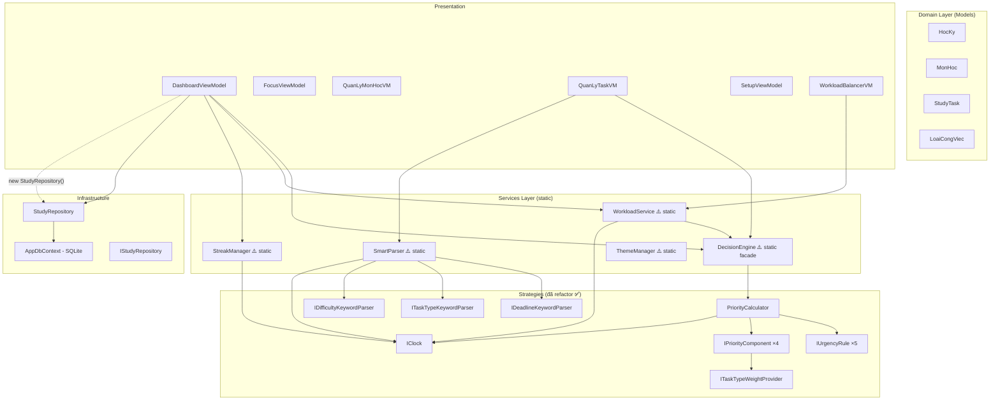
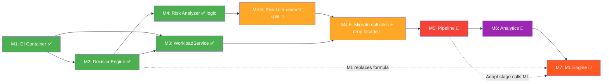

# Smart Study Planner — Kế hoạch Phát triển v1.6 → v2.0

> **Phân tích dựa trên:** GitNexus (461 symbols, 1,469 relationships, 36 execution flows) + code-review-graph
> **Cập nhật mới nhất:** 2026-04-25 — verify lại trạng thái thực tế trên branch `progress`.

---

## 0. Status Snapshot (2026-04-25)

### Trạng thái commit

- HEAD branch `progress` đang ở `281d78f` (87 unit tests cho Decision Engine + SmartParser strategies).
- **Toàn bộ code M1 → M4 nằm trong working tree, CHƯA commit.** Cần tách 4 commit theo concern trước khi đi tiếp:
  1. `chore: bootstrap DI container via ServiceLocator` (M1)
  2. `refactor: extract IDecisionEngine + DecisionEngineService instance` (M2)
  3. `refactor: extract IWorkloadService + WorkloadServiceImpl with IDecisionEngine injection` (M3)
  4. `feat: add RiskAnalyzer strategy + integrate vào DashboardViewModel` (M4)

### Verify từng module

| Module | Code | Tests | DI wire-up | UI | Trạng thái |
|---|---|---|---|---|---|
| **M1** DI Container | `Services/ServiceLocator.cs`, `App.OnStartup` gọi `Configure()` | — | ✅ | n/a | Done — uncommitted |
| **M2** DecisionEngine refactor | `IDecisionEngine.cs`, `DecisionEngineService.cs` (inject `ITaskTypeWeightProvider` + `IClock`) | tests cũ pass | ✅ Singleton | n/a | Done — uncommitted |
| **M3** WorkloadService refactor | `IWorkloadService.cs`, `WorkloadServiceImpl.cs` (inject `IDecisionEngine` + `IClock`), `Models/ScheduleModels.cs` | cần thêm tests integration | ✅ Singleton | `DashboardViewModel` đã inject | Done — uncommitted |
| **M4** RiskAnalyzer | `Services/RiskAnalyzer/` (5 file: `IRiskAnalyzer`, `RiskAnalyzerService`, `IRiskComponent` (3 component inline), `RiskAssessment`, `RiskLevel`) | `RiskAnalyzerTests.cs` (10 case) | ✅ Singleton | ⚠️ `TaskDashboardItem.RiskScore` có data, **DashboardPage.xaml CHƯA bind** | Done logic — UI thiếu |

### Test counter (chính xác)

- **59 `[Fact]/[Theory]`** trên 7 file (con số "110 tests" trong plan cũ là đếm cả DataRow của `[Theory]` — không sát).
- Phân bố: `DecisionEngineTests` 6, `PriorityCalculatorTests` 9, `PriorityComponentsTests` 11, `UrgencyRulesTests` 5, `DefaultTaskTypeWeightProviderTests` 2, `SmartParserStrategiesTests` 16, `RiskAnalyzerTests` 10.

### Gap phát hiện sau verify

1. **Risk UI chưa render** — `TaskDashboardItem.RiskScore` được populate trong `DashboardViewModel` nhưng `DashboardPage.xaml` chưa có cột/badge nào bind vào. Chuỗi "Plan → Execute → Measure" đang đứt ở chỗ user không thấy được output Risk.
2. **Call sites cũ chưa migrate hết** — Cần verify `QuanLyTaskViewModel`, `WorkloadBalancerViewModel`, `MainWindow.xaml.cs` còn gọi `DecisionEngine.CalculatePriority` static hay đã dùng `ServiceLocator.Get<IDecisionEngine>()`. Nếu còn static thì facade `DecisionEngine.cs` + `WorkloadService.cs` không xoá được.
3. **`MainWindow.xaml.cs` background timer** — vẫn vi phạm MVVM (background priority recompute nằm code-behind), backlog từ smell #3 trong DecisionEngine_Review.
4. **NU1904** — `System.Drawing.Common` transitive vulnerability vẫn còn (item N6 trong memory roadmap).

---

## 1. Hiện trạng Kiến trúc (sau M1-M4)

### Dependency Graph hiện tại



### Blast Radius (từ GitNexus impact analysis)

| Symbol | Risk | Direct (d=1) | Indirect (d=2) |
|--------|------|-------------|----------------|
| `DecisionEngine` | MEDIUM | 7 files (3 VM + 4 test) | 6 files (Views) |
| `WorkloadService` | MEDIUM | 7 files | 6 files |

### Technical Debt tồn đọng

| # | Vấn đề | Mức độ | Ghi chú |
|---|--------|--------|---------|
| 1 | **Tất cả Service là `static class`** — không inject, không mock | 🔴 Cao | `DecisionEngine`, `WorkloadService`, `SmartParser`, `StreakManager` |
| 2 | **Không có DI Container** — `App.xaml.cs` chỉ `EnsureCreated()` | 🔴 Cao | ViewModel `new StudyRepository()` trực tiếp |
| 3 | **`MainWindow.xaml.cs` chứa business logic** — background timer tính priority | 🟡 Trung | Vi phạm MVVM |
| 4 | **Thiếu `IDecisionEngine`, `IWorkloadService`** interfaces | 🔴 Cao | README yêu cầu rõ ràng |
| 5 | **`CalculateRawSuggestedMinutes` và `SuggestStudyTime` chưa Strategy** | 🟡 Trung | Vẫn nằm trong facade |
| 6 | **Chưa có Risk Analyzer** | 🟡 Trung | README §4.3 đã định nghĩa công thức |
| 7 | **Chưa có Pipeline Orchestrator** | 🔴 Cao | README §2 mô tả pipeline nhưng chưa implement |
| 8 | **Chưa có Adaptive Engine** | 🟡 Trung | README §4.4 có rule-based spec |

### Những gì ĐÃ hoàn thành tốt ✅

- Strategy Pattern cho DecisionEngine (Ổ 1, 2, 3 đã refactor)
- `PriorityCalculator` instance-based với constructor injection
- `IClock` + `FakeClock` cho deterministic testing
- SmartParser strategies (`IDeadlineKeywordParser`, `ITaskTypeKeywordParser`, `IDifficultyKeywordParser`)
- 87 unit tests (6 test files) covering strategies
- `IStudyRepository` interface đã có

---

## 2. Kế hoạch Phát triển — 6 Module Tuần tự

> **Nguyên tắc**: Mỗi module hoàn thành → app vẫn build & chạy được → commit → chuyển module tiếp.

---

### Module 1: DI Container & Service Registration

**Mục tiêu**: Thiết lập `Microsoft.Extensions.DependencyInjection` làm nền tảng cho toàn bộ refactor sau này.

**Tại sao làm đầu tiên**: Tất cả module sau đều cần DI để inject interface thay vì gọi static.

#### Các bước

1. **Thêm NuGet**: `Microsoft.Extensions.DependencyInjection` vào `SmartStudyPlanner.csproj`
2. **Tạo `ServiceLocator.cs`** (tạm thời, WPF không có built-in DI host):
   ```
   Services/ServiceLocator.cs [NEW]
   - static IServiceProvider Provider
   - static void Configure(IServiceCollection services)
   ```
3. **Cập nhật `App.xaml.cs`**:
   - Gọi `ServiceLocator.Configure()` trong `OnStartup`
   - Register `IStudyRepository → StudyRepository`
   - Register `IClock → SystemClock`
   - Register `ITaskTypeWeightProvider → DefaultTaskTypeWeightProvider`
4. **Smoke test**: App khởi động bình thường, không breaking change

#### Files ảnh hưởng
- `SmartStudyPlanner.csproj` — thêm package
- `App.xaml.cs` — thêm DI setup
- `Services/ServiceLocator.cs` — [NEW]

#### Verification
- `dotnet build` thành công
- App launch và navigate qua tất cả pages
- Tất cả 87 tests pass

---

### Module 2: DecisionEngine → Instance-based + Interface

**Mục tiêu**: Chuyển `DecisionEngine` từ static facade sang instance-based, tạo `IDecisionEngine` interface, register vào DI.

> [!IMPORTANT]
> Đây là thay đổi có blast radius lớn nhất (7 files d=1, 6 files d=2). Cần giữ static facade wrapper tạm thời.

#### Các bước

1. **Tạo `IDecisionEngine.cs`** [NEW]:
   ```csharp
   public interface IDecisionEngine
   {
       double CalculatePriority(StudyTask task, MonHoc monHoc);
       int CalculateRawSuggestedMinutes(StudyTask task);
       string SuggestStudyTime(StudyTask task);
       WeightConfig Config { get; }
   }
   ```

2. **Tạo `DecisionEngineService.cs`** [NEW] — instance-based implementation:
   - Inject `PriorityCalculator`, `IClock`, `WeightConfig`
   - Implement `IDecisionEngine`
   - Di chuyển `CalculateRawSuggestedMinutes` và `SuggestStudyTime` từ static class sang

3. **Giữ nguyên `DecisionEngine.cs` static facade** — delegate sang `DecisionEngineService` singleton
   - Zero breaking cho 7 call sites hiện tại

4. **Register trong DI**:
   ```csharp
   services.AddSingleton<IDecisionEngine, DecisionEngineService>();
   ```

5. **Migrate dần các ViewModel** (có thể tách sang commit riêng):
   - `DashboardViewModel` → inject `IDecisionEngine`
   - `QuanLyTaskViewModel` → inject `IDecisionEngine`
   - `WorkloadBalancerViewModel` → inject `IDecisionEngine`

6. **Unit tests mới**: Test `DecisionEngineService` với mock `IClock`

#### Files ảnh hưởng
- `Services/IDecisionEngine.cs` — [NEW]
- `Services/DecisionEngineService.cs` — [NEW]
- `Services/DecisionEngine.cs` — giữ facade, delegate
- `App.xaml.cs` — register
- `ViewModels/DashboardViewModel.cs` — inject (optional phase)
- `ViewModels/QuanLyTaskViewModel.cs` — inject (optional phase)

#### Verification
- 87 tests cũ vẫn pass
- Tests mới cho `DecisionEngineService`
- App chạy bình thường

---

### Module 3: WorkloadService → Instance-based + Interface

**Mục tiêu**: Tương tự Module 2, refactor `WorkloadService` sang instance-based.

#### Các bước

1. **Tạo `IWorkloadService.cs`** [NEW]:
   ```csharp
   public interface IWorkloadService
   {
       double GetCapacity();
       void SaveCapacity(double capacity);
       List<ScheduleDay> GenerateSchedule(HocKy hocKy, double capacityHours);
   }
   ```

2. **Tạo `WorkloadServiceImpl.cs`** [NEW]:
   - Inject `IDecisionEngine`, `IClock`
   - Loại bỏ dependency trực tiếp vào `DecisionEngine` static

3. **Tách `ScheduledTask`, `ScheduleDay`** sang file riêng `Models/ScheduleModels.cs` [NEW]

4. **Giữ static facade** trong `WorkloadService.cs` (tương thích ngược)

5. **Register trong DI** + migrate `DashboardViewModel`, `WorkloadBalancerViewModel`

6. **Unit tests**: Test `WorkloadServiceImpl.GenerateSchedule` với fake data

#### Files ảnh hưởng
- `Services/IWorkloadService.cs` — [NEW]
- `Services/WorkloadServiceImpl.cs` — [NEW]
- `Models/ScheduleModels.cs` — [NEW]
- `Services/WorkloadService.cs` — delegate
- `App.xaml.cs` — register

#### Verification
- Tất cả tests pass
- Workload Balancer window hiển thị đúng schedule
- Dashboard "Kế hoạch học tập hôm nay" vẫn hoạt động

---

### Module 4: Risk Analyzer Engine

**Mục tiêu**: Implement `IRiskAnalyzer` theo công thức trong README §4.3.

> [!NOTE]
> Module này **hoàn toàn mới**, không breaking bất kỳ code hiện tại nào. Có thể phát triển song song nếu cần.

#### Các bước

1. **Tạo `Services/RiskAnalyzer/`** directory:
   ```
   IRiskAnalyzer.cs          — interface
   RiskAnalyzer.cs           — implementation
   IRiskComponent.cs         — strategy interface
   DeadlineUrgencyRisk.cs    — 0.5 weight
   ProgressGapRisk.cs        — 0.3 weight
   PerformanceDropRisk.cs    — 0.2 weight
   RiskLevel.cs              — enum (Low, Medium, High, Critical)
   RiskAssessment.cs         — result DTO
   ```

2. **Công thức** (từ README):
   ```
   Risk = DeadlineUrgency * 0.5 + ProgressGap * 0.3 + PerformanceDrop * 0.2
   ```

3. **Tích hợp vào Dashboard**:
   - Thêm cột "Mức độ rủi ro" cho Top 5 tasks
   - Thêm biểu đồ Risk Distribution

4. **Register trong DI**: `services.AddSingleton<IRiskAnalyzer, RiskAnalyzer>()`

5. **Mở rộng Model** (nếu cần):
   - Thêm `ProgressPercent` vào `StudyTask` hoặc tính từ `ThoiGianDaHoc / SuggestedMinutes`

#### Files ảnh hưởng
- `Services/RiskAnalyzer/` — [NEW] toàn bộ
- `ViewModels/DashboardViewModel.cs` — thêm risk display
- `Views/DashboardPage.xaml` — thêm UI element
- `Models/StudyTask.cs` — có thể thêm property

#### Verification
- Unit tests cho từng `IRiskComponent`
- Integration test cho `RiskAnalyzer.Assess(task, monHoc)`
- Dashboard hiển thị risk level đúng

---

### Module 4.5: Đóng gói M1-M4 (UI Risk + Commit splitting)

**Mục tiêu**: Hoàn thiện phần UI thiếu của M4 và commit lại lịch sử cho gọn trước khi sang M5.

**Tại sao chèn ở đây**: Status snapshot phát hiện M4 mới có data layer, chưa render. Đồng thời M1-M4 còn nguyên 1 đống uncommitted — không tách concern thì khi rollback sẽ kéo cả chùm.

#### Các bước

1. **Render Risk lên Dashboard** (`Views/DashboardPage.xaml`):
   - Thêm cột mới "Mức rủi ro" trong DataGrid Top 5 task, hoặc thêm badge bên cạnh `DiemUuTien`.
   - Bind `{Binding RiskScore, StringFormat={}{0:P0}}` + converter `RiskLevelToColorConverter` đọc từ `RiskAssessment.FromScore(RiskScore)`.
   - (Optional) thêm Pie/Column chart "Risk Distribution" theo 4 mức `Low/Medium/High/Critical`.
2. **Mở rộng `TaskDashboardItem`** thêm property `RiskLevel` (string hoặc enum) để binding XAML đỡ phải gọi converter logic.
3. **Tách commit** đúng thứ tự M1 → M2 → M3 → M4 (xem §0 cho commit message gợi ý). Mỗi commit phải build pass + test xanh độc lập (test commit thử bằng `git stash` từng lần).
4. **Smoke test cuối**: chạy app, mở Dashboard, xác nhận Risk hiển thị đúng cho task quá hạn / sắp deadline / mới tạo.

#### Files ảnh hưởng

- `Views/DashboardPage.xaml` — thêm UI element
- `Models/TaskDashboardItem.cs` — có thể thêm `RiskLevel` property
- `Views/Converters/` — [NEW] `RiskLevelToColorConverter.cs` (tuỳ chọn)

#### Verification

- 59 test cũ vẫn pass
- App khởi động → Dashboard hiển thị cột Risk có màu phân biệt
- 4 commit M1-M4 trong git log, mỗi commit revert được độc lập

---

### Module 4.6: Migrate call sites cũ + xoá static facade

**Mục tiêu**: Loại bỏ `DecisionEngine.cs` (static) và `WorkloadService.cs` (static facade) sau khi tất cả caller đã chuyển sang DI. Đây là điểm chốt trước khi xây Pipeline Orchestrator.

> [!IMPORTANT]
> Việc này phải làm SAU M4.5 commit xong, vì blast radius cao (theo DecisionEngine_Review §1: 7 call sites + 6 file Views).

#### Các bước

1. **Audit call sites còn dùng static** — chạy:
   ```
   gitnexus_query({pattern: "callers_of", target: "DecisionEngine.CalculatePriority"})
   gitnexus_query({pattern: "callers_of", target: "WorkloadService.GenerateSchedule"})
   ```
2. **Migrate từng caller** — inject qua constructor (lấy từ `ServiceLocator.Get<T>()` ở chỗ tạo VM):
   - `ViewModels/QuanLyTaskViewModel.cs:65` (`CalculatePriority`)
   - `ViewModels/WorkloadBalancerViewModel.cs` (`GenerateSchedule`)
   - `Views/MainWindow.xaml.cs:81` (background timer — nên trích ra `MainWindowViewModel` luôn để gỡ MVVM violation)
3. **Bonus**: Tách `MainWindow.xaml.cs` background priority recompute thành `MainWindowViewModel` (giải quyết technical debt #3 trong status snapshot).
4. **Xoá facade static** — chỉ xoá khi `gitnexus_impact({target: "DecisionEngine", direction: "upstream"})` trả về 0 caller bên ngoài file `DecisionEngineService.cs`.
5. **Update memory** — note lại rằng `DecisionEngine.Config` static đã không còn (item N4 từ memory đã đóng).

#### Files ảnh hưởng

- 3 ViewModel + `MainWindow.xaml.cs`
- `Services/DecisionEngine.cs` — DELETE
- `Services/WorkloadService.cs` — DELETE
- (Optional) `ViewModels/MainWindowViewModel.cs` — [NEW]

#### Verification

- Tất cả 59 test pass
- App chạy đầy đủ flow (Dashboard, QuanLyTask, WorkloadBalancer, MainWindow tray)
- `gitnexus_detect_changes` báo chỉ chạm các file dự kiến

---

### Module 5: Pipeline Orchestrator

**Mục tiêu**: Implement luồng `Plan → Execute → Measure → Adapt → Re-plan` theo README §1.

> [!IMPORTANT]
> Module này là **core architecture** mới, cần thiết kế kỹ. Nó orchestrate toàn bộ engine pipeline thay vì để ViewModel gọi trực tiếp.

#### Các bước

1. **Tạo `Services/Pipeline/`** directory:
   ```
   IPipelineOrchestrator.cs        — interface chính
   PipelineOrchestrator.cs         — implementation
   PipelineContext.cs              — shared state giữa các stage
   IPipelineStage.cs               — interface cho mỗi bước
   Stages/
     ParseInputStage.cs            — SmartParser wrapper
     PrioritizeStage.cs            — DecisionEngine wrapper
     BalanceWorkloadStage.cs       — WorkloadService wrapper
     AssessRiskStage.cs            — RiskAnalyzer wrapper
     AdaptStage.cs                 — Rule-based adaptation (từ README §4.4)
   ```

2. **Pipeline flow**:
   ```
   PipelineContext ctx = new(hocKy, userSettings);
   await orchestrator.ExecuteAsync(ctx);
   // ctx.Schedule, ctx.RiskReport, ctx.Adaptations now populated
   ```

3. **Adaptive Logic** (Rule-based MVP từ README §4.4):
   ```csharp
   If Progress < ExpectedProgress   → increase priority
   If MilestoneScore > EntryScore   → reduce workload
   If subject skipped multiple times → increase priority weight
   ExpectedProgress = DaysPassed / TotalDays
   ```

4. **Tích hợp**: `DashboardViewModel.LoadDuLieuDashboard()` gọi orchestrator thay vì gọi từng service riêng lẻ

#### Files ảnh hưởng
- `Services/Pipeline/` — [NEW] toàn bộ
- `ViewModels/DashboardViewModel.cs` — refactor `LoadDuLieuDashboard`
- `App.xaml.cs` — register pipeline services

#### Verification
- Unit tests cho từng `IPipelineStage`
- Integration test cho full pipeline
- Dashboard vẫn hiển thị đúng sau refactor

---

### Module 6: Study Analytics & Insights

**Mục tiêu**: Thêm module phân tích dữ liệu học tập, cung cấp insights cho người dùng.

> [!NOTE]
> Module cuối cùng, phụ thuộc vào tất cả module trước. Đây là tính năng "wow factor" cho v2.0.

#### Các bước

1. **Tạo `Services/Analytics/`** directory:
   ```
   IStudyAnalytics.cs              — interface
   StudyAnalyticsService.cs        — implementation
   Models/
     WeeklyReport.cs               — DTO báo cáo tuần
     SubjectInsight.cs             — phân tích theo môn
     StudyPattern.cs               — pattern detection
     ProductivityScore.cs          — điểm năng suất
   ```

2. **Metrics cần tính**:
   - Tổng thời gian học / tuần, xu hướng tăng/giảm
   - Tỷ lệ hoàn thành deadline
   - Subject với risk cao nhất
   - Productivity score = f(completion_rate, time_efficiency, streak)
   - Study pattern detection (morning/afternoon/evening learner)

3. **Tạo `AnalyticsPage.xaml`** [NEW]:
   - Biểu đồ trend theo tuần
   - Radar chart theo môn học
   - Productivity score card
   - Recommendations dựa trên data

4. **Mở rộng `StudyTask`**:
   - Thêm `NgayHoanThanh` (DateTime?) — khi nào hoàn thành
   - Thêm `SoLanBoQua` (int) — tracking subject skipping

5. **Navigation**: Thêm button "Analytics" trên MainWindow sidebar

#### Files ảnh hưởng
- `Services/Analytics/` — [NEW] toàn bộ
- `Views/AnalyticsPage.xaml` + `.cs` — [NEW]
- `ViewModels/AnalyticsViewModel.cs` — [NEW]
- `Models/StudyTask.cs` — thêm properties
- `Views/MainWindow.xaml.cs` — thêm navigation
- `Data/AppDbContext.cs` — migration nếu cần

#### Verification
- Unit tests cho analytics calculations
- UI hiển thị charts đúng
- Data accuracy validation

---

### Module 7: ML Engine (3 Sub-models)

**Mục tiêu**: Tạo hạ tầng ML có thể scale, với 3 model con hoạt động độc lập.

> [!IMPORTANT]
> Module này **tách biệt** khỏi Module 5 (Pipeline) và Module 6 (Analytics).
> Pipeline gọi ML thông qua interface — nếu model chưa train xong hoặc chưa đủ data, tự động fallback về rule-based.

#### Kiến trúc tổng quan

```
Services/ML/
├── IMLModelManager.cs              — quản lý load/save/retrain tất cả model
├── MLModelManager.cs               — implementation
├── Models/                         — input/output schema cho ML.NET
│   ├── TextParserInput.cs          — "Nộp báo cáo AI thứ 6"
│   ├── TextParserOutput.cs         — { TaskName, TaskType, Deadline, Difficulty }
│   ├── StudyTimeInput.cs           — { TaskType, Difficulty, Credits, DaysLeft, ... }
│   ├── StudyTimeOutput.cs          — { PredictedMinutes }
│   ├── WeightConfigInput.cs        — { CompletionRate, AvgDelay, MissRate, ... }
│   └── WeightConfigOutput.cs       — { TimeWeight, TaskTypeWeight, CreditWeight, DifficultyWeight }
├── Trainers/
│   ├── IModelTrainer.cs            — strategy interface
│   ├── TextClassifierTrainer.cs    — Sub-model 1
│   ├── StudyTimeTrainer.cs         — Sub-model 2
│   └── WeightOptimizerTrainer.cs   — Sub-model 3
├── Predictors/
│   ├── ITextClassifier.cs          — interface cho SmartParser integration
│   ├── IStudyTimePredictor.cs      — interface cho DecisionEngine integration
│   └── IWeightOptimizer.cs         — interface cho Adaptive Engine
└── Data/
    ├── StudyLog.cs                 — Entity: session-based tracking (DB table mới)
    ├── TrainingDataGenerator.cs    — sinh mock data ban đầu
    └── DatasetExporter.cs          — export CSV cho train
```

#### Sub-model 1: Text Classifier (SmartParser Enhancement)

**Bài toán**: Multi-label classification — phân tích câu tiếng Việt thành structured task.

| Input | Output |
|-------|--------|
| "Nộp báo cáo AI thứ 6 tuần sau" | `{ TaskName: "báo cáo AI", TaskType: DoAnCuoiKy, DeadlineHint: "thứ 6 tuần sau", Difficulty: 3 }` |

**ML.NET Approach**:
- Dùng `TextFeaturizer` → `SdcaMaximumEntropy` (multi-class) cho TaskType classification
- Kết hợp với regex SmartParser hiện tại: ML classify → SmartParser parse deadline → merge

**Dữ liệu huấn luyện**:
- Sinh mock 500-1000 câu tiếng Việt + nhãn (có thể nhờ bạn hoặc dùng dataset)
- Kaggle datasets: "Student Assignment Text Classification"

**Fallback**: Nếu model confidence < 0.6 → dùng `SmartParser` regex thuần

#### Sub-model 2: Study Time Predictor (Regression)

**Bài toán**: Regression — dự đoán số phút học cần thiết.

| Input features | Output |
|----------------|--------|
| TaskType, Difficulty, Credits, DaysLeft, ThoiGianDaHoc, HistoricalAvg | PredictedMinutes |

**ML.NET Approach**:
- `FastTreeRegressionTrainer` cho initial model (non-linear relationships)
- `OnlineGradientDescentTrainer` cho **incremental learning** (retrain khi có data mới)
- Train ban đầu với mock/synthetic data → retrain dần bằng dữ liệu thực

**Thay thế**:
```
// Trước (formula cứng):
(DiemUuTien / 100.0) * 120.0 + (DoKho / 5.0) * 60.0

// Sau (ML prediction):
_studyTimePredictor.Predict(input).PredictedMinutes
```

**Fallback**: Nếu model R² < 0.5 hoặc chưa train → dùng formula cũ

#### Sub-model 3: WeightConfig Optimizer

**Bài toán**: Multi-output regression — tối ưu 4 trọng số WeightConfig.

| Input features | Output |
|----------------|--------|
| CompletionRate, AvgDelay, DeadlineMissRate, SubjectSkipCount, StreakDays | TimeWeight, TaskTypeWeight, CreditWeight, DifficultyWeight |

**ML.NET Approach**:
- `AutoML` chạy lúc app khởi động (background) nếu có đủ 50+ data points
- Constraint: tổng 4 weight phải = 1.0 → post-process normalize
- Retrain mỗi tuần hoặc khi user hoàn thành 10 tasks mới

**Fallback**: Nếu chưa đủ data → giữ `WeightConfig` mặc định (0.40, 0.30, 0.20, 0.10)

#### Data Strategy: StudyLog Table

```csharp
public class StudyLog
{
    [Key] public Guid Id { get; set; }
    public Guid MaTask { get; set; }
    public DateTime NgayHoc { get; set; }        // Ngày phiên học
    public int SoPhutHoc { get; set; }           // Thời gian thực tế
    public int SoPhutDuKien { get; set; }        // Thời gian dự kiến lúc đó
    public bool DaHoanThanh { get; set; }        // Hoàn thành trong phiên này?
    public int DiemUuTienLucDo { get; set; }     // Priority score tại thời điểm học
    public string? GhiChu { get; set; }          // Optional notes
}
```

**Tại sao dùng bảng riêng**: Scale tốt hơn, không bloat StudyTask, cho phép time-series analysis, và có thể export CSV dễ dàng cho training.

#### Các bước triển khai

1. **Phase 1 — Infrastructure** (2-3h):
   - Cài NuGet: `Microsoft.ML`, `Microsoft.ML.AutoML`
   - Tạo `Services/ML/` directory structure
   - Tạo `StudyLog` entity + DbSet trong `AppDbContext`
   - Tạo `IMLModelManager` interface + registration

2. **Phase 2 — Data Collection** (1-2h):
   - Hook vào `FocusViewModel` để tự động ghi `StudyLog` mỗi phiên Pomodoro
   - Hook vào `QuanLyTaskViewModel.HoanThanhTask` để ghi completion event
   - Tạo `TrainingDataGenerator` cho mock data ban đầu

3. **Phase 3 — Sub-model 2 (Study Time)** (3-4h):
   - Implement `StudyTimeTrainer` + `IStudyTimePredictor`
   - Train với mock data → validate R²
   - Tích hợp vào `DecisionEngineService.CalculateRawSuggestedMinutes` (behind feature flag)

4. **Phase 4 — Sub-model 1 (Text Classifier)** (3-4h):
   - Thu thập/sinh training data (500+ Vietnamese sentences)
   - Implement `TextClassifierTrainer` + `ITextClassifier`
   - Tích hợp vào `SmartParser.Parse()` — ML phân loại → regex parse deadline

5. **Phase 5 — Sub-model 3 (Weight Optimizer)** (2-3h):
   - Implement `WeightOptimizerTrainer` + `IWeightOptimizer`
   - Background retrain logic
   - Tích hợp vào Pipeline Orchestrator (Adapt stage)

#### Verification
- Unit tests cho mỗi trainer (mock data → train → predict → assert reasonable range)
- Integration test: full pipeline với ML models loaded
- Benchmark: inference latency < 10ms per prediction
- Fallback test: model unavailable → rule-based vẫn hoạt động

---

## 3. Dependency Map giữa các Module (cập nhật)



## 4. Ước lượng Thời gian (cập nhật 2026-04-25)

| Module | Trạng thái | Thời gian | Rủi ro |
|--------|------------|-----------|--------|
| M1: DI Container | ✅ Done — uncommitted | 1h | — |
| M2: DecisionEngine refactor | ✅ Done — uncommitted | 2h | — |
| M3: WorkloadService refactor | ✅ Done — uncommitted | 1h | — |
| M4: Risk Analyzer (logic + tests) | ✅ Done — uncommitted, **UI thiếu** | 2h | — |
| **M4.5**: Render Risk + tách 4 commit M1-M4 | 🔲 **Next** | 1.5-2h | 🟢 Thấp |
| **M4.6**: Migrate call sites + xoá facade static | 🔲 | 2-3h | 🟡 Trung (7 call sites) |
| M5: Pipeline Orchestrator | 🔲 | 5-6h | 🔴 Cao |
| M6: Study Analytics | 🔲 | 5-6h | 🟡 Trung |
| M7: ML Engine (5 phases) | 🔲 | 11-16h | 🔴 Cao (data dependency) |
| Backlog N6: upgrade `System.Drawing.Common` (NU1904) | 🔲 | 30 phút | 🟢 Thấp |
| **Tổng còn lại** | | **~25-33h** | |

### Thứ tự đề xuất

```
M4.5 → commit M1-M4 → M4.6 → M5 → M6 → M7
                     └─ N6 chen vào lúc nào cũng được (độc lập)
```

## 5. Quy tắc Bắt buộc (từ README §8)

> [!CAUTION]
> Mọi thay đổi PHẢI tuân thủ:
> - Không sửa priority formula / risk calculation / balancer logic nếu không có chỉ thị rõ ràng
> - Không dùng `DateTime.Now`, `Random()`, DB calls trong algorithm logic
> - Không dùng `new DecisionEngine()` — chỉ depend on interfaces
> - Mọi thay đổi engine phải có unit test + edge case
> - Chạy `gitnexus_impact` trước khi sửa bất kỳ symbol nào
> - Chạy `gitnexus_detect_changes` trước khi commit

## Open Questions (Resolved & New)

> [!NOTE]
> **Đã giải quyết từ phiên trước:**
> 1. ~~Module 4 PerformanceDrop~~ → Dùng `DoKho` làm proxy (v1), sẽ thay bằng ML model (v2)
> 2. ~~Pipeline sync/async~~ → Sync MVP, async khi có ML inference
> 3. ~~Analytics DB migration~~ → Dùng `StudyLog` table riêng, vẫn `EnsureCreated`
> 4. ~~Ngôn ngữ code~~ → Giữ tiếng Việt cho domain names, tiếng Anh cho technical names

> [!IMPORTANT]
> **Câu hỏi mới cho Module 7 (ML):**
> 1. **Training data cho Text Classifier**: Bạn có thể tạo ~500 câu tiếng Việt mẫu dạng "Nộp báo cáo AI thứ 6" + nhãn `{ TaskType, Difficulty }` không? Hoặc muốn tôi sinh mock data?
> 2. **Retrain frequency**: WeightConfig Optimizer nên retrain khi nào — mỗi lần mở app, mỗi tuần, hay sau mỗi N tasks hoàn thành?
> 3. **Feature flag**: Muốn dùng boolean flag đơn giản (`EnableMLPrediction = true/false`) hay settings UI cho user tự bật/tắt từng model?
