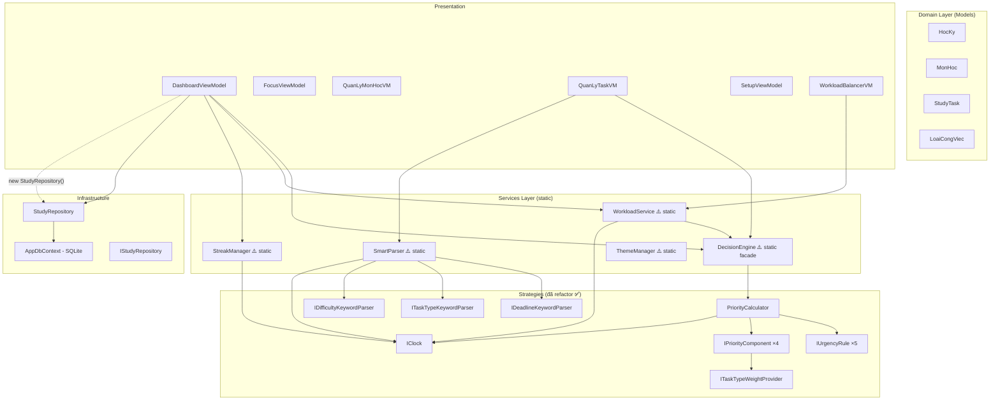
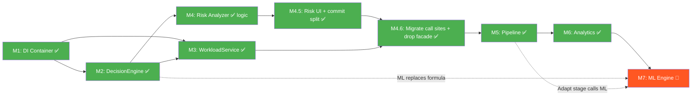

# Smart Study Planner — Kế hoạch Phát triển v1.6 → v2.0

> **Phân tích dựa trên:** GitNexus (461 symbols, 1,469 relationships, 36 execution flows) + code-review-graph
> **Cập nhật mới nhất:** 2026-04-26 — M1→M7 hoàn tất, PR #34–#37 đã merge vào `dev`. M6.1/M7 docs đã đồng bộ.

---

## 0. Status Snapshot (2026-04-26)

### Trạng thái hiện tại

- **PR #34** (`progress → dev`) đã merged lúc 04:12 UTC 2026-04-25.
- Branch `dev` chứa toàn bộ M1 → M4.6 (8 commits + 1 merge commit).
- **PR #35** (`feat(M5): add pipeline orchestrator and integrate dashboard flow → dev`) đã merge.
- **PR #36** (`feat(ui): UI/UX upgrade — sidebar navigation, dark mode fix, stat cards, badge column → dev`) đã merge.
- **PR #37** (`feat(M6): Study Analytics & Insights — StudyLog, AnalyticsPage, sidebar nav → dev`) đã merge.
- **M6.1** (`Task Notes & Study Links`) đã hoàn thành; PR merge đang chờ cập nhật trạng thái trong docs nhưng codebase đã triển khai xong.
- **M7** (`Study Time Predictor`) đã hoàn thành và review đã lưu trong `docs/superpowers/reviews/2026-04-26-m7-code-review.md`.
- **DEV-RESET** đã được chuyển sang chế độ opt-in qua `DEV_RESET_DB=1`; DB giữ lại mặc định giữa các lần mở app.
- **Theme toggle** đã được hook lại ở shell cấp cao để hoạt động trên mọi trang (MainWindow gọi thẳng `ThemeManager.ToggleTheme()`).
- **Semester end date** hiện tự suy 150 ngày và cho phép user override sau (SetupViewModel + SetupPage đã expose field này).
- Tests: **119/119 pass** | Build: **0 error**.
- **M5 Pipeline Orchestrator** đã hoàn thành và được merge sang `dev` qua PR #35.
- **UI/UX Upgrade** đã hoàn thành (PR #36): sidebar navigation, stat cards, badge columns, token theming, section icons.
- **Study Analytics & Insights** đã hoàn thành (PR #37): StudyLog, AnalyticsPage, sidebar nav, analytics service.
- Plan chi tiết M5 debt + M6: `docs/superpowers/plans/2026-04-25-m5-debt-m6-analytics.md`

### Những gì đã hoàn thành (v1.6 phase 1)

| Module | Mô tả | Commit |
|---|---|---|
| M1+M2 | `ServiceLocator` DI root + `IDecisionEngine` / `DecisionEngineService` | `1cfe438` |
| M3 | `IWorkloadService` / `WorkloadServiceImpl` + `ScheduleModels.cs` | `45cbbb3` |
| M4 | `RiskAnalyzer/` strategy engine, 110 tests, Dashboard UI cột "Rủi Ro" | `7b5d7d3` |
| M4.6 | Xoá static facades (`DecisionEngine.cs`, `WorkloadService.cs`), tách `WeightConfig.cs`, migrate `MainWindow.xaml.cs` | `af673d2` |

**Kiến trúc Services sau M4.6 — không còn `static class` trong domain:**
```
ServiceLocator
  ├── IStudyRepository   → StudyRepository
  ├── IClock             → SystemClock
  ├── ITaskTypeWeightProvider → DefaultTaskTypeWeightProvider
  ├── IDecisionEngine    → DecisionEngineService
  ├── IWorkloadService   → WorkloadServiceImpl
  └── IRiskAnalyzer      → RiskAnalyzerService
```

### TODO còn lại

| # | Việc | Module | Ưu tiên | Ghi chú |
|---|------|--------|---------|---------|
| 1 | Pipeline Orchestrator — 5 stages, `PipelineContext`, `IPipelineStage` | **M5** | ✅ Hoàn thành | Merged PR #35 |
| 2 | Extract `StudyTaskStatus` constants (7 magic strings) | **M5-TD1** | ✅ Hoàn thành | Verified 2026-04-26 |
| 3 | `HocKy.NgayKetThuc [NotMapped]` + fix `AdaptStage` semester duration | **M5-TD2** | ✅ Hoàn thành | Verified 2026-04-26 |
| 4 | Wire `RiskReport` vào `BuildDashboardSummary`, xóa duplicate computation | **M5-TD3** | ✅ Hoàn thành | Verified 2026-04-26 |
| 5 | Surface `Adaptations` lên Dashboard UI | **M5-TD4** | ✅ Hoàn thành | Verified 2026-04-26 |
| 6 | Study Analytics — `StudyLog`, `IStudyAnalytics`, `AnalyticsPage.xaml`, 3 charts | **M6** | ✅ Hoàn thành | Merged PR #37 (updated 2026-04-26 19:07 +07:00) |
| 6.1 | Task Notes & Study Links — `TaskNote`, `TaskReferenceLink`, 3-zone editor UI | **M6.1** | ✅ Hoàn thành | 141 tests pass |
| 7 | ML Engine — `StudyTimePredictor` offline-first MVP | **M7** | ✅ Hoàn thành | Docs + review đồng bộ; see `docs/superpowers/reviews/2026-04-26-m7-code-review.md` |
| 8 | M8-A: Text Classifier for `SmartParser` | **M8-A** | 🔲 Planned | See `docs/superpowers/specs/2026-04-26-m8-ml-suite-expansion.md` |
| 9 | M8-B: Weight Optimizer for `WeightConfig` replacement | **M8-B** | 🔲 Planned | Threshold: >=0.75 auto-suggest, 0.60-0.75 review, <0.60 manual |
| 8 | Dev Reset — clean slate DB + ML artifacts | **DEV-RESET** | ✅ Planned | Dev-only baseline reset, then reseed + retrain |
| 9 | Fix NU1904 `System.Drawing.Common` vulnerability | **N6** | 🟡 Trung | Độc lập, ~30 phút |
| 9 | Tách `BackgroundTimer_Tick` → `MainWindowViewModel` | **Bonus** | 🟢 Thấp | MVVM cleanup |
| 10 | Re-index GitNexus sau M5 | **Tooling** | ✅ Hoàn thành | Re-indexed 2026-04-25 |
| 11 | Dev clean reset (DB + ML artifacts) | **DEV-RESET** | ✅ Hoàn thành | Clean slate reset executed; see `docs/superpowers/reports/2026-04-26-dev-reset-clean-slate-report.md` |
| 12 | Dev startup keeps DB persistence by default; clean reset opt-in via `DEV_RESET_DB=1` | **DEV-RESET** | ✅ Hoàn thành | Avoids losing semester data on restart; clean reset remains available when needed |

---

## 1. Hiện trạng Kiến trúc (sau M1-M4)

### Dependency Graph hiện tại



### Blast Radius (từ GitNexus impact analysis)

| Symbol | Risk | Direct (d=1) | Indirect (d=2) |
|--------|------|-------------|----------------|
| `DecisionEngine` | MEDIUM | 7 files (3 VM + 4 test) | 6 files (Views) |
| `WorkloadService` | MEDIUM | 7 files | 6 files |

### Technical Debt tồn đọng

| # | Vấn đề | Mức độ | Ghi chú |
|---|--------|--------|---------|
| 1 | **Tất cả Service là `static class`** — không inject, không mock | 🔴 Cao | `DecisionEngine`, `WorkloadService`, `SmartParser`, `StreakManager` |
| 2 | **Không có DI Container** — `App.xaml.cs` chỉ `EnsureCreated()` | 🔴 Cao | ViewModel `new StudyRepository()` trực tiếp |
| 3 | **`MainWindow.xaml.cs` chứa business logic** — background timer tính priority | 🟡 Trung | Vi phạm MVVM |
| 4 | **Thiếu `IDecisionEngine`, `IWorkloadService`** interfaces | 🔴 Cao | README yêu cầu rõ ràng |
| 5 | **`CalculateRawSuggestedMinutes` và `SuggestStudyTime` chưa Strategy** | 🟡 Trung | Vẫn nằm trong facade |
| 6 | **Chưa có Risk Analyzer** | 🟡 Trung | README §4.3 đã định nghĩa công thức |
| 7 | **Chưa có Pipeline Orchestrator** | 🔴 Cao | README §2 mô tả pipeline nhưng chưa implement |
| 8 | **Chưa có Adaptive Engine** | 🟡 Trung | README §4.4 có rule-based spec |

### Những gì ĐÃ hoàn thành tốt ✅

- Strategy Pattern cho DecisionEngine (Ổ 1, 2, 3 đã refactor)
- `PriorityCalculator` instance-based với constructor injection
- `IClock` + `FakeClock` cho deterministic testing
- SmartParser strategies (`IDeadlineKeywordParser`, `ITaskTypeKeywordParser`, `IDifficultyKeywordParser`)
- 87 unit tests (6 test files) covering strategies
- `IStudyRepository` interface đã có

---

## 2. Kế hoạch Phát triển — 6 Module Tuần tự

> **Nguyên tắc**: Mỗi module hoàn thành → app vẫn build & chạy được → commit → chuyển module tiếp.

---

### Module 1: DI Container & Service Registration

**Mục tiêu**: Thiết lập `Microsoft.Extensions.DependencyInjection` làm nền tảng cho toàn bộ refactor sau này.

**Tại sao làm đầu tiên**: Tất cả module sau đều cần DI để inject interface thay vì gọi static.

#### Các bước

1. **Thêm NuGet**: `Microsoft.Extensions.DependencyInjection` vào `SmartStudyPlanner.csproj`
2. **Tạo `ServiceLocator.cs`** (tạm thời, WPF không có built-in DI host):
   ```
   Services/ServiceLocator.cs [NEW]
   - static IServiceProvider Provider
   - static void Configure(IServiceCollection services)
   ```
3. **Cập nhật `App.xaml.cs`**:
   - Gọi `ServiceLocator.Configure()` trong `OnStartup`
   - Register `IStudyRepository → StudyRepository`
   - Register `IClock → SystemClock`
   - Register `ITaskTypeWeightProvider → DefaultTaskTypeWeightProvider`
4. **Smoke test**: App khởi động bình thường, không breaking change

#### Files ảnh hưởng
- `SmartStudyPlanner.csproj` — thêm package
- `App.xaml.cs` — thêm DI setup
- `Services/ServiceLocator.cs` — [NEW]

#### Verification
- `dotnet build` thành công
- App launch và navigate qua tất cả pages
- Tất cả 87 tests pass

---

### Module 2: DecisionEngine → Instance-based + Interface

**Mục tiêu**: Chuyển `DecisionEngine` từ static facade sang instance-based, tạo `IDecisionEngine` interface, register vào DI.

> [!IMPORTANT]
> Đây là thay đổi có blast radius lớn nhất (7 files d=1, 6 files d=2). Cần giữ static facade wrapper tạm thời.

#### Các bước

1. **Tạo `IDecisionEngine.cs`** [NEW]:
   ```csharp
   public interface IDecisionEngine
   {
       double CalculatePriority(StudyTask task, MonHoc monHoc);
       int CalculateRawSuggestedMinutes(StudyTask task);
       string SuggestStudyTime(StudyTask task);
       WeightConfig Config { get; }
   }
   ```

2. **Tạo `DecisionEngineService.cs`** [NEW] — instance-based implementation:
   - Inject `PriorityCalculator`, `IClock`, `WeightConfig`
   - Implement `IDecisionEngine`
   - Di chuyển `CalculateRawSuggestedMinutes` và `SuggestStudyTime` từ static class sang

3. **Giữ nguyên `DecisionEngine.cs` static facade** — delegate sang `DecisionEngineService` singleton
   - Zero breaking cho 7 call sites hiện tại

4. **Register trong DI**:
   ```csharp
   services.AddSingleton<IDecisionEngine, DecisionEngineService>();
   ```

5. **Migrate dần các ViewModel** (có thể tách sang commit riêng):
   - `DashboardViewModel` → inject `IDecisionEngine`
   - `QuanLyTaskViewModel` → inject `IDecisionEngine`
   - `WorkloadBalancerViewModel` → inject `IDecisionEngine`

6. **Unit tests mới**: Test `DecisionEngineService` với mock `IClock`

#### Files ảnh hưởng
- `Services/IDecisionEngine.cs` — [NEW]
- `Services/DecisionEngineService.cs` — [NEW]
- `Services/DecisionEngine.cs` — giữ facade, delegate
- `App.xaml.cs` — register
- `ViewModels/DashboardViewModel.cs` — inject (optional phase)
- `ViewModels/QuanLyTaskViewModel.cs` — inject (optional phase)

#### Verification
- 87 tests cũ vẫn pass
- Tests mới cho `DecisionEngineService`
- App chạy bình thường

---

### Module 3: WorkloadService → Instance-based + Interface

**Mục tiêu**: Tương tự Module 2, refactor `WorkloadService` sang instance-based.

#### Các bước

1. **Tạo `IWorkloadService.cs`** [NEW]:
   ```csharp
   public interface IWorkloadService
   {
       double GetCapacity();
       void SaveCapacity(double capacity);
       List<ScheduleDay> GenerateSchedule(HocKy hocKy, double capacityHours);
   }
   ```

2. **Tạo `WorkloadServiceImpl.cs`** [NEW]:
   - Inject `IDecisionEngine`, `IClock`
   - Loại bỏ dependency trực tiếp vào `DecisionEngine` static

3. **Tách `ScheduledTask`, `ScheduleDay`** sang file riêng `Models/ScheduleModels.cs` [NEW]

4. **Giữ static facade** trong `WorkloadService.cs` (tương thích ngược)

5. **Register trong DI** + migrate `DashboardViewModel`, `WorkloadBalancerViewModel`

6. **Unit tests**: Test `WorkloadServiceImpl.GenerateSchedule` với fake data

#### Files ảnh hưởng
- `Services/IWorkloadService.cs` — [NEW]
- `Services/WorkloadServiceImpl.cs` — [NEW]
- `Models/ScheduleModels.cs` — [NEW]
- `Services/WorkloadService.cs` — delegate
- `App.xaml.cs` — register

#### Verification
- Tất cả tests pass
- Workload Balancer window hiển thị đúng schedule
- Dashboard "Kế hoạch học tập hôm nay" vẫn hoạt động

---

### Module 4: Risk Analyzer Engine

**Mục tiêu**: Implement `IRiskAnalyzer` theo công thức trong README §4.3.

> [!NOTE]
> Module này **hoàn toàn mới**, không breaking bất kỳ code hiện tại nào. Có thể phát triển song song nếu cần.

#### Các bước

1. **Tạo `Services/RiskAnalyzer/`** directory:
   ```
   IRiskAnalyzer.cs          — interface
   RiskAnalyzer.cs           — implementation
   IRiskComponent.cs         — strategy interface
   DeadlineUrgencyRisk.cs    — 0.5 weight
   ProgressGapRisk.cs        — 0.3 weight
   PerformanceDropRisk.cs    — 0.2 weight
   RiskLevel.cs              — enum (Low, Medium, High, Critical)
   RiskAssessment.cs         — result DTO
   ```

2. **Công thức** (từ README):
   ```
   Risk = DeadlineUrgency * 0.5 + ProgressGap * 0.3 + PerformanceDrop * 0.2
   ```

3. **Tích hợp vào Dashboard**:
   - Thêm cột "Mức độ rủi ro" cho Top 5 tasks
   - Thêm biểu đồ Risk Distribution

4. **Register trong DI**: `services.AddSingleton<IRiskAnalyzer, RiskAnalyzer>()`

5. **Mở rộng Model** (nếu cần):
   - Thêm `ProgressPercent` vào `StudyTask` hoặc tính từ `ThoiGianDaHoc / SuggestedMinutes`

#### Files ảnh hưởng
- `Services/RiskAnalyzer/` — [NEW] toàn bộ
- `ViewModels/DashboardViewModel.cs` — thêm risk display
- `Views/DashboardPage.xaml` — thêm UI element
- `Models/StudyTask.cs` — có thể thêm property

#### Verification
- Unit tests cho từng `IRiskComponent`
- Integration test cho `RiskAnalyzer.Assess(task, monHoc)`
- Dashboard hiển thị risk level đúng

---

### Module 4.5: Đóng gói M1-M4 (UI Risk + Commit splitting)

**Mục tiêu**: Hoàn thiện phần UI thiếu của M4 và commit lại lịch sử cho gọn trước khi sang M5.

**Tại sao chèn ở đây**: Status snapshot phát hiện M4 mới có data layer, chưa render. Đồng thời M1-M4 còn nguyên 1 đống uncommitted — không tách concern thì khi rollback sẽ kéo cả chùm.

#### Các bước

1. **Render Risk lên Dashboard** (`Views/DashboardPage.xaml`):
   - Thêm cột mới "Mức rủi ro" trong DataGrid Top 5 task, hoặc thêm badge bên cạnh `DiemUuTien`.
   - Bind `{Binding RiskScore, StringFormat={}{0:P0}}` + converter `RiskLevelToColorConverter` đọc từ `RiskAssessment.FromScore(RiskScore)`.
   - (Optional) thêm Pie/Column chart "Risk Distribution" theo 4 mức `Low/Medium/High/Critical`.
2. **Mở rộng `TaskDashboardItem`** thêm property `RiskLevel` (string hoặc enum) để binding XAML đỡ phải gọi converter logic.
3. **Tách commit** đúng thứ tự M1 → M2 → M3 → M4 (xem §0 cho commit message gợi ý). Mỗi commit phải build pass + test xanh độc lập (test commit thử bằng `git stash` từng lần).
4. **Smoke test cuối**: chạy app, mở Dashboard, xác nhận Risk hiển thị đúng cho task quá hạn / sắp deadline / mới tạo.

#### Files ảnh hưởng

- `Views/DashboardPage.xaml` — thêm UI element
- `Models/TaskDashboardItem.cs` — có thể thêm `RiskLevel` property
- `Views/Converters/` — [NEW] `RiskLevelToColorConverter.cs` (tuỳ chọn)

#### Verification

- 59 test cũ vẫn pass
- App khởi động → Dashboard hiển thị cột Risk có màu phân biệt
- 4 commit M1-M4 trong git log, mỗi commit revert được độc lập

---

### Module 4.6: Migrate call sites cũ + xoá static facade

**Mục tiêu**: Loại bỏ `DecisionEngine.cs` (static) và `WorkloadService.cs` (static facade) sau khi tất cả caller đã chuyển sang DI. Đây là điểm chốt trước khi xây Pipeline Orchestrator.

> [!IMPORTANT]
> Việc này phải làm SAU M4.5 commit xong, vì blast radius cao (theo DecisionEngine_Review §1: 7 call sites + 6 file Views).

#### Các bước

1. **Audit call sites còn dùng static** — chạy:
   ```
   gitnexus_query({pattern: "callers_of", target: "DecisionEngine.CalculatePriority"})
   gitnexus_query({pattern: "callers_of", target: "WorkloadService.GenerateSchedule"})
   ```
2. **Migrate từng caller** — inject qua constructor (lấy từ `ServiceLocator.Get<T>()` ở chỗ tạo VM):
   - `ViewModels/QuanLyTaskViewModel.cs:65` (`CalculatePriority`)
   - `ViewModels/WorkloadBalancerViewModel.cs` (`GenerateSchedule`)
   - `Views/MainWindow.xaml.cs:81` (background timer — nên trích ra `MainWindowViewModel` luôn để gỡ MVVM violation)
3. **Bonus**: Tách `MainWindow.xaml.cs` background priority recompute thành `MainWindowViewModel` (giải quyết technical debt #3 trong status snapshot).
4. **Xoá facade static** — chỉ xoá khi `gitnexus_impact({target: "DecisionEngine", direction: "upstream"})` trả về 0 caller bên ngoài file `DecisionEngineService.cs`.
5. **Update memory** — note lại rằng `DecisionEngine.Config` static đã không còn (item N4 từ memory đã đóng).

#### Files ảnh hưởng

- 3 ViewModel + `MainWindow.xaml.cs`
- `Services/DecisionEngine.cs` — DELETE
- `Services/WorkloadService.cs` — DELETE
- (Optional) `ViewModels/MainWindowViewModel.cs` — [NEW]

#### Verification

- Tất cả 59 test pass
- App chạy đầy đủ flow (Dashboard, QuanLyTask, WorkloadBalancer, MainWindow tray)
- `gitnexus_detect_changes` báo chỉ chạm các file dự kiến

---

### Module 5: Pipeline Orchestrator

**Trạng thái**: ✅ **HOÀN THÀNH** (`865ca47`) — xem PR #35.

**Kiến trúc đã triển khai:**
```
Services/Pipeline/
├── IPipelineOrchestrator.cs      ✅
├── PipelineOrchestrator.cs       ✅
├── PipelineContext.cs            ✅  (Semester, Settings, ReferenceTime, RiskReport, Adaptations)
├── IPipelineStage.cs             ✅
├── PipelineExecutionResult.cs    ✅
└── Stages/
    ├── ParseInputStage.cs        ✅
    ├── PrioritizeStage.cs        ✅
    ├── BalanceWorkloadStage.cs   ✅
    ├── AssessRiskStage.cs        ✅
    └── AdaptStage.cs             ✅  (rule-based: progress_below_expected, reduce_workload, increase_priority)
```

`DashboardViewModel.LoadDuLieuDashboard()` gọi `IPipelineOrchestrator.ExecuteAsync()` → nhận `PipelineExecutionResult` → gọi `BuildDashboardSummary(result)`.

---

### Module 5 — Technical Debt (🔲 Pending)

> **Plan chi tiết**: `docs/superpowers/plans/2026-04-25-m5-debt-m6-analytics.md` — Tasks TD-1 → TD-4.
> Branch mục tiêu: `feat/m5-pipeline-orchestrator` (PR #36 đang mở).

| Task | Mô tả | Effort |
|------|-------|--------|
| **TD-1** | Extract `StudyTaskStatus` constants — xóa 7 magic string `"Hoàn thành"` / `"Chưa làm"` | ~20 phút |
| **TD-2** | Thêm `HocKy.NgayKetThuc [NotMapped]` + fix `AdaptStage.AssumedSemesterDays=120` → dùng real end date | ~30 phút |
| **TD-3** | Wire `pipelineResult.RiskReport` vào `BuildDashboardSummary` → loại bỏ duplicate priority+risk computation | ~45 phút |
| **TD-4** | Surface `pipelineResult.Adaptations` lên Dashboard UI (collapsible "GỢI Ý THÍCH NGHI" section) | ~30 phút |

#### TD-1: Extract StudyTaskStatus Constants

**Files:**
- Create: `SmartStudyPlanner/Models/StudyTaskStatus.cs`
- Modify: `StudyTask.cs:44`, `PrioritizeStage.cs:48,54`, `AssessRiskStage.cs:46`, `AdaptStage.cs:43`, `DashboardViewModel.cs:133,138,255`, `FocusViewModel.cs:104`, `MainWindow.xaml.cs:94`

```csharp
// Models/StudyTaskStatus.cs
public static class StudyTaskStatus
{
    public const string ChuaLam   = "Chưa làm";
    public const string HoanThanh = "Hoàn thành";
}
```

**Verification**: `dotnet test` → `119 passed`

#### TD-2: HocKy.NgayKetThuc [NotMapped]

**Files:** `Models/HocKy.cs`, `Services/Pipeline/Stages/AdaptStage.cs`, `SmartStudyPlanner.Tests/PipelineStageTests.cs`

```csharp
// HocKy.cs — thêm sau NgayBatDau
[NotMapped] public DateTime NgayKetThuc { get; set; }
// constructor: NgayKetThuc = ngayBatDau.AddDays(120); // default fallback

// AdaptStage.cs — thay AssumedSemesterDays=120
private const int FallbackSemesterDays = 120;
var end      = semester.NgayKetThuc != default ? semester.NgayKetThuc.Date : start.AddDays(FallbackSemesterDays);
var totalDays = Math.Max(1, (end - start).Days);
```

**New test** (target 120 passed):
```csharp
[Fact]
public void AdaptStage_Uses_NgayKetThuc_WhenSet()
{
    var start = new DateTime(2026, 1, 1);
    var hocKy = new HocKy("HK-Test", start) { NgayKetThuc = start.AddDays(10) };
    // ... 4 tasks, ctx.ReferenceTime = day 5 → expectedProgress=50%, 0 done → suggestion generated
    Assert.Contains(ctx.Adaptations!, a => a.RuleKey == "progress_below_expected");
}
```

#### TD-3: Eliminate Duplicate Pipeline Computation

**Files:** `Services/RiskAnalyzer/RiskAssessment.cs`, `Services/Pipeline/Stages/AssessRiskStage.cs`, `ViewModels/DashboardViewModel.cs`, `Tests/PipelineStageTests.cs`

1. Thêm `public Guid TaskId { get; init; }` vào `RiskAssessment`
2. `AssessRiskStage` set `TaskId = task.MaTask` khi tạo assessment
3. `BuildDashboardSummary(PipelineExecutionResult result)`:
   - Xóa dòng `task.DiemUuTien = _decisionEngine.CalculatePriority(...)` (PrioritizeStage đã set)
   - Thay `_riskAnalyzer.Assess(task, mon)` bằng lookup: `riskById.TryGetValue(task.MaTask, out var cached) ? cached : _riskAnalyzer.Assess(task, mon)`

**Verification**: `dotnet test` → `121 passed`

#### TD-4: Surface Adaptations trên Dashboard UI

**Files:** `ViewModels/DashboardViewModel.cs`, `Views/DashboardPage.xaml`

```csharp
// DashboardViewModel.cs
[ObservableProperty] private ObservableCollection<AdaptationSuggestion> adaptationItems = new();
public bool HasAdaptations => AdaptationItems.Count > 0;
// Sau ApplySchedule(): ApplyAdaptations(pipelineResult.Adaptations); OnPropertyChanged(nameof(HasAdaptations));
```

XAML: collapsible `ItemsControl` với `DataTrigger Binding="{Binding HasAdaptations}" Value="False" → Collapsed`, icon `&#xE8CA;` + `{Binding Message}` per item.

**Verification**: `dotnet test` → `121 passed`; UI hiển thị suggestions khi `AdaptStage` trigger rule.

---

### Module 6: Study Analytics & Insights

**Trạng thái**: ✅ **HOÀN THÀNH** (merged PR #37 vào `dev`)

> **Plan chi tiết**: `docs/superpowers/plans/2026-04-25-m5-debt-m6-analytics.md` — Tasks M6-1 → M6-6.
> **Tech Stack bổ sung**: `LiveChartsCore.SkiaSharpView.WPF` (đã có trong project).

#### File Map M6

| Action | Path |
|--------|------|
| Create | `Models/StudyLog.cs` |
| Modify | `Models/StudyTask.cs` — thêm `NgayHoanThanh DateTime?` |
| Modify | `Data/IStudyRepository.cs` + `StudyRepository.cs` — thêm `AddStudyLogAsync`, `GetStudyLogsAsync` |
| Modify | `Data/AppDbContext.cs` — thêm `DbSet<StudyLog> StudyLogs` |
| Create | `Services/Analytics/IStudyAnalytics.cs` |
| Create | `Services/Analytics/StudyAnalyticsService.cs` |
| Create | `Services/Analytics/Models/WeeklyReport.cs` |
| Create | `Services/Analytics/Models/SubjectInsight.cs` |
| Create | `Services/Analytics/Models/ProductivityScore.cs` |
| Modify | `ViewModels/FocusViewModel.cs` — inject `IStudyRepository`, write log on complete |
| Create | `ViewModels/AnalyticsViewModel.cs` |
| Create | `Views/AnalyticsPage.xaml` + `.xaml.cs` |
| Modify | `Views/MainWindow.xaml` + `.cs` — thêm `NavAnalytics` sidebar button |
| Modify | `App.xaml.cs` — register `IStudyAnalytics` |
| Create | `SmartStudyPlanner.Tests/AnalyticsServiceTests.cs` |

#### M6-1: StudyLog Entity + NgayHoanThanh + DB Registration

**Status**: ✅ Hoàn thành

```csharp
// Models/StudyLog.cs
public class StudyLog
{
    [Key] public Guid Id { get; set; } = Guid.NewGuid();
    public Guid MaTask       { get; set; }
    public DateTime NgayHoc  { get; set; }
    public int SoPhutHoc     { get; set; }
    public int SoPhutDuKien  { get; set; }
    public bool DaHoanThanh  { get; set; }
    public string? GhiChu    { get; set; }
}
```

`StudyTask.cs`: thêm `public DateTime? NgayHoanThanh { get; set; }` (nullable, EnsureCreated không break).
`AppDbContext`: thêm `public DbSet<StudyLog> StudyLogs { get; set; }`.

**Verification**: `dotnet test` → `123 passed`

#### M6-2: IStudyAnalytics + StudyAnalyticsService

**Status**: ✅ Hoàn thành

**Interface:**
```csharp
public interface IStudyAnalytics
{
    WeeklyReport        ComputeWeeklyMinutes(IEnumerable<StudyLog> logs, DateTime referenceDate);
    List<SubjectInsight> ComputeSubjectInsights(HocKy hocKy, IEnumerable<StudyLog> logs);
    ProductivityScore   ComputeProductivityScore(double completionRate, int streakDays, double timeEfficiency);
}
```

**Công thức ProductivityScore**: `completionRate×50 + (min(streak,30)/30)×30 + timeEfficiency×20` capped [0, 100].

**WeeklyReport**: 7 entries (day-6 → today), `DayLabels` + `MinutesPerDay`.

**SubjectInsight**: per-subject `{ SubjectName, TotalTaskCount, CompletedTaskCount, CompletionRate, TotalStudyMinutes }`.

**ProductivityScore.Label**: `≥85="Xuất sắc"`, `≥70="Tốt"`, `≥50="Trung bình"`, `≥30="Cần cải thiện"`, else `"Chưa có dữ liệu"`.

**Verification**: 4 unit tests, `dotnet test` → `127 passed`

#### M6-3: Hook StudyLog vào FocusViewModel

**Status**: ✅ Hoàn thành

`IStudyRepository` thêm 2 methods:
```csharp
Task AddStudyLogAsync(StudyLog log);
Task<List<StudyLog>> GetStudyLogsAsync(HocKy hocKy);
```

`FocusViewModel`: delegating constructor `(TaskDashboardItem task) : this(task, ServiceLocator.Get<IStudyRepository>())`.
`LuuThoiGianThucTe(bool daHoanThanh)` → ghi `StudyLog` async (fire-and-forget).
`HoanThanh()` → set `task.NgayHoanThanh = DateTime.Today`.

**Verification**: `FakeStudyRepository` mock + test `FocusViewModel_WritesStudyLog_OnHoanThanh` → `128 passed`

#### M6-4: AnalyticsViewModel + DI Registration

**Status**: ✅ Hoàn thành

`App.xaml.cs`: `services.AddSingleton<IStudyAnalytics, StudyAnalyticsService>()`.

`AnalyticsViewModel`:
- Fields: `HocKy _hocKy`, `IStudyRepository _repository`, `IStudyAnalytics _analytics`
- ObservableProperties: `ISeries[] WeeklyChartSeries`, `Axis[] WeeklyChartXAxes`, `ISeries[] SubjectChartSeries`, `Axis[] SubjectChartXAxes`, `int ProductivityValue`, `string ProductivityLabel`, `ObservableCollection<SubjectInsight> SubjectInsights`
- `public async Task LoadAsync()` — gọi `GetStudyLogsAsync` → `ComputeWeeklyMinutes` → `ComputeSubjectInsights` → `ComputeProductivityScore`

#### M6-5: AnalyticsPage.xaml — 3 LiveCharts2 Charts

**Status**: ✅ Hoàn thành

**Layout** (ScrollViewer > StackPanel):
1. **Header**: "PHÂN TÍCH HỌC TẬP" + `{Binding TrangThai}`
2. **Productivity Score Card**: icon `&#xE9D9;`, `{Binding ProductivityValue} điểm`, `{Binding ProductivityLabel}`
3. **Weekly Bar Chart** (`CartesianChart`, height 220): `Series={Binding WeeklyChartSeries}`, `XAxes={Binding WeeklyChartXAxes}` — ColumnSeries màu CornflowerBlue
4. **Subject Bar Chart** (`CartesianChart`, height 220): completion rate per subject — ColumnSeries màu MediumSeaGreen
5. **Details DataGrid**: columns `Môn Học | Tổng Task | Đã xong | Tỉ lệ HT | Giờ đã học`

`AnalyticsPage.xaml.cs`: `Loaded += async (_, _) => await _vm.LoadAsync()`; expose `public HocKy HocKy => _vm.HocKy`.

#### M6-6: Sidebar Navigation

**Status**: ✅ Hoàn thành

`MainWindow.xaml`: thêm `NavAnalytics` button (icon `&#xE9D9;`, text "Analytics") sau `NavWorkload`.

`MainWindow.xaml.cs`:
- `SetActiveNav`: thêm `NavAnalytics` vào array
- `NavAnalytics_Click`: `MainFrame.Navigate(new AnalyticsPage(_currentHocKy))`
- `MainFrame_Navigated`: `else if (e.Content is AnalyticsPage ap) _currentHocKy = ap.HocKy`

**Final Verification**: `dotnet test` → `128 passed`; mở app → sidebar "Analytics" → trang hiển thị 3 charts đúng dữ liệu.

---

### Module 7: ML Engine (3 Sub-models)

**Mục tiêu**: Tạo hạ tầng ML có thể scale, với 3 model con hoạt động độc lập.

> [!IMPORTANT]
> Module này **tách biệt** khỏi Module 5 (Pipeline) và Module 6 (Analytics).
> Pipeline gọi ML thông qua interface — nếu model chưa train xong hoặc chưa đủ data, tự động fallback về rule-based.

#### Kiến trúc tổng quan

```
Services/ML/
├── IMLModelManager.cs              — quản lý load/save/retrain tất cả model
├── MLModelManager.cs               — implementation
├── Models/                         — input/output schema cho ML.NET
│   ├── TextParserInput.cs          — "Nộp báo cáo AI thứ 6"
│   ├── TextParserOutput.cs         — { TaskName, TaskType, Deadline, Difficulty }
│   ├── StudyTimeInput.cs           — { TaskType, Difficulty, Credits, DaysLeft, ... }
│   ├── StudyTimeOutput.cs          — { PredictedMinutes }
│   ├── WeightConfigInput.cs        — { CompletionRate, AvgDelay, MissRate, ... }
│   └── WeightConfigOutput.cs       — { TimeWeight, TaskTypeWeight, CreditWeight, DifficultyWeight }
├── Trainers/
│   ├── IModelTrainer.cs            — strategy interface
│   ├── TextClassifierTrainer.cs    — Sub-model 1
│   ├── StudyTimeTrainer.cs         — Sub-model 2
│   └── WeightOptimizerTrainer.cs   — Sub-model 3
├── Predictors/
│   ├── ITextClassifier.cs          — interface cho SmartParser integration
│   ├── IStudyTimePredictor.cs      — interface cho DecisionEngine integration
│   └── IWeightOptimizer.cs         — interface cho Adaptive Engine
└── Data/
    ├── StudyLog.cs                 — Entity: session-based tracking (DB table mới)
    ├── TrainingDataGenerator.cs    — sinh mock data ban đầu
    └── DatasetExporter.cs          — export CSV cho train
```

#### Sub-model 1: Text Classifier (SmartParser Enhancement)

**Bài toán**: Multi-label classification — phân tích câu tiếng Việt thành structured task.

| Input | Output |
|-------|--------|
| "Nộp báo cáo AI thứ 6 tuần sau" | `{ TaskName: "báo cáo AI", TaskType: DoAnCuoiKy, DeadlineHint: "thứ 6 tuần sau", Difficulty: 3 }` |

**ML.NET Approach**:
- Dùng `TextFeaturizer` → `SdcaMaximumEntropy` (multi-class) cho TaskType classification
- Kết hợp với regex SmartParser hiện tại: ML classify → SmartParser parse deadline → merge

**Dữ liệu huấn luyện**:
- Sinh mock 500-1000 câu tiếng Việt + nhãn (có thể nhờ bạn hoặc dùng dataset)
- Kaggle datasets: "Student Assignment Text Classification"

**Fallback**: Nếu model confidence < 0.6 → dùng `SmartParser` regex thuần

#### Sub-model 2: Study Time Predictor (Regression)

**Bài toán**: Regression — dự đoán số phút học cần thiết.

| Input features | Output |
|----------------|--------|
| TaskType, Difficulty, Credits, DaysLeft, ThoiGianDaHoc, HistoricalAvg | PredictedMinutes |

**ML.NET Approach**:
- `FastTreeRegressionTrainer` cho initial model (non-linear relationships)
- `OnlineGradientDescentTrainer` cho **incremental learning** (retrain khi có data mới)
- Train ban đầu với mock/synthetic data → retrain dần bằng dữ liệu thực

**Thay thế**:
```
// Trước (formula cứng):
(DiemUuTien / 100.0) * 120.0 + (DoKho / 5.0) * 60.0

// Sau (ML prediction):
_studyTimePredictor.Predict(input).PredictedMinutes
```

**Fallback**: Nếu model R² < 0.5 hoặc chưa train → dùng formula cũ

#### Sub-model 3: WeightConfig Optimizer

**Bài toán**: Multi-output regression — tối ưu 4 trọng số WeightConfig.

| Input features | Output |
|----------------|--------|
| CompletionRate, AvgDelay, DeadlineMissRate, SubjectSkipCount, StreakDays | TimeWeight, TaskTypeWeight, CreditWeight, DifficultyWeight |

**ML.NET Approach**:
- `AutoML` chạy lúc app khởi động (background) nếu có đủ 50+ data points
- Constraint: tổng 4 weight phải = 1.0 → post-process normalize
- Retrain mỗi tuần hoặc khi user hoàn thành 10 tasks mới

**Fallback**: Nếu chưa đủ data → giữ `WeightConfig` mặc định (0.40, 0.30, 0.20, 0.10)

#### Data Strategy: StudyLog Table

```csharp
public class StudyLog
{
    [Key] public Guid Id { get; set; }
    public Guid MaTask { get; set; }
    public DateTime NgayHoc { get; set; }        // Ngày phiên học
    public int SoPhutHoc { get; set; }           // Thời gian thực tế
    public int SoPhutDuKien { get; set; }        // Thời gian dự kiến lúc đó
    public bool DaHoanThanh { get; set; }        // Hoàn thành trong phiên này?
    public int DiemUuTienLucDo { get; set; }     // Priority score tại thời điểm học
    public string? GhiChu { get; set; }          // Optional notes
}
```

**Tại sao dùng bảng riêng**: Scale tốt hơn, không bloat StudyTask, cho phép time-series analysis, và có thể export CSV dễ dàng cho training.

#### Các bước triển khai

1. **Phase 1 — Infrastructure** (2-3h):
   - Cài NuGet: `Microsoft.ML`, `Microsoft.ML.AutoML`
   - Tạo `Services/ML/` directory structure
   - Tạo `StudyLog` entity + DbSet trong `AppDbContext`
   - Tạo `IMLModelManager` interface + registration

2. **Phase 2 — Data Collection** (1-2h):
   - Hook vào `FocusViewModel` để tự động ghi `StudyLog` mỗi phiên Pomodoro
   - Hook vào `QuanLyTaskViewModel.HoanThanhTask` để ghi completion event
   - Tạo `TrainingDataGenerator` cho mock data ban đầu

3. **Phase 3 — Sub-model 2 (Study Time)** (3-4h):
   - Implement `StudyTimeTrainer` + `IStudyTimePredictor`
   - Train với mock data → validate R²
   - Tích hợp vào `DecisionEngineService.CalculateRawSuggestedMinutes` (behind feature flag)

4. **Phase 4 — Sub-model 1 (Text Classifier)** (3-4h):
   - Thu thập/sinh training data (500+ Vietnamese sentences)
   - Implement `TextClassifierTrainer` + `ITextClassifier`
   - Tích hợp vào `SmartParser.Parse()` — ML phân loại → regex parse deadline

5. **Phase 5 — Sub-model 3 (Weight Optimizer)** (2-3h):
   - Implement `WeightOptimizerTrainer` + `IWeightOptimizer`
   - Background retrain logic
   - Tích hợp vào Pipeline Orchestrator (Adapt stage)

#### Verification
- Unit tests cho mỗi trainer (mock data → train → predict → assert reasonable range)
- Integration test: full pipeline với ML models loaded
- Benchmark: inference latency < 10ms per prediction
- Fallback test: model unavailable → rule-based vẫn hoạt động

---

## 3. Dependency Map giữa các Module (cập nhật)



## 4. Ước lượng Thời gian (cập nhật 2026-04-25)

| Module | Trạng thái | Thời gian | Rủi ro |
|--------|------------|-----------|--------|
| M1: DI Container | ✅ Done — uncommitted | 1h | — |
| M2: DecisionEngine refactor | ✅ Done — uncommitted | 2h | — |
| M3: WorkloadService refactor | ✅ Done — uncommitted | 1h | — |
| M4: Risk Analyzer (logic + tests) | ✅ Done — uncommitted, **UI thiếu** | 2h | — |
| **M4.5**: Render Risk + tách 4 commit M1-M4 | ✅ Done (`c74db6b`…`be8a06e`) | 1.5h | — |
| **M4.6**: Migrate call sites + xoá facade static | ✅ Done (`af673d2`) | 1.5h | — |
| M5: Pipeline Orchestrator | ✅ Done (`865ca47`) | 5-6h | — |
| M5 Technical Debt (TD-1→4) | 🔲 **Next** (branch `feat/m5-pipeline-orchestrator`) | ~2h | 🟡 Thấp |
| M6: Study Analytics | 🔲 Sau khi TD merge | 5-6h | 🟡 Trung |
| M6.1: Task notes & study links (DB split + rich UX) | ✅ Done (`M6.1`) | 4-6h | 🟠 Trung-Cao |
| M7: ML Engine (5 phases) | ✅ Done | 11-16h | 🔴 Cao (data dependency) |
| Backlog N6: upgrade `System.Drawing.Common` (NU1904) | 🔲 | 30 phút | 🟢 Thấp |
| **Tổng còn lại** | | **~27-37h** | |

### Thứ tự đề xuất

```
[M4.5 ✅] → [M4.6 ✅] → [M5 ✅] → M6 ✅ → M6.1 ✅ → M7 ✅ → DEV-RESET ✅ → M8 planned
                                            └─ N6 chen vào lúc nào cũng được (độc lập)
```

**Kết quả sau M4.6**: Không còn `static class` nào trong Services layer.
`DecisionEngine.cs` và `WorkloadService.cs` đã bị xoá. `WeightConfig` sống ở `Services/WeightConfig.cs`.
`MainWindow.xaml.cs` resolve DI qua `ServiceLocator`. 110 tests pass.

## 5. Quy tắc Bắt buộc (từ README §8)

> [!CAUTION]
> Mọi thay đổi PHẢI tuân thủ:
> - Không sửa priority formula / risk calculation / balancer logic nếu không có chỉ thị rõ ràng
> - Không dùng `DateTime.Now`, `Random()`, DB calls trong algorithm logic
> - Không dùng `new DecisionEngine()` — chỉ depend on interfaces
> - Mọi thay đổi engine phải có unit test + edge case
> - Chạy `gitnexus_impact` trước khi sửa bất kỳ symbol nào
> - Chạy `gitnexus_detect_changes` trước khi commit

## Open Questions (Resolved & New)

> [!NOTE]
> **Đã giải quyết từ phiên trước:**
> 1. ~~Module 4 PerformanceDrop~~ → Dùng `DoKho` làm proxy (v1), sẽ thay bằng ML model (v2)
> 2. ~~Pipeline sync/async~~ → Sync MVP, async khi có ML inference
> 3. ~~Analytics DB migration~~ → Dùng `StudyLog` table riêng, vẫn `EnsureCreated`
> 4. ~~Ngôn ngữ code~~ → Giữ tiếng Việt cho domain names, tiếng Anh cho technical names
5. ~~Task notes & study links scope~~ → M6.1 đã hoàn thành theo phương án B: tách bảng DB, UI phân vùng rõ, parser nhập nhanh không điền notes/links

> [!IMPORTANT]
> **Câu hỏi mới cho Module 7 (ML):**
> 1. **Training data cho Text Classifier**: Bạn có thể tạo ~500 câu tiếng Việt mẫu dạng "Nộp báo cáo AI thứ 6" + nhãn `{ TaskType, Difficulty }` không? Hoặc muốn tôi sinh mock data?
> 2. **Retrain frequency**: WeightConfig Optimizer nên retrain khi nào — mỗi lần mở app, mỗi tuần, hay sau mỗi N tasks hoàn thành?
> 3. **Feature flag**: Muốn dùng boolean flag đơn giản (`EnableMLPrediction = true/false`) hay settings UI cho user tự bật/tắt từng model?

> **M6.1 (Task notes & study links) — kết luận đã hoàn thành:**
> - Storage model: phương án B, tách bảng DB cho `TaskNote` và `TaskReferenceLink`.
> - Input behavior: parser nhập nhanh chỉ fill core task fields, tuyệt đối không đụng notes/links.
> - UX layout: ưu tiên tách riêng note và link; nếu không khả thi thì dùng rich text document với layout phân dòng giống bảng để tối ưu UX.
