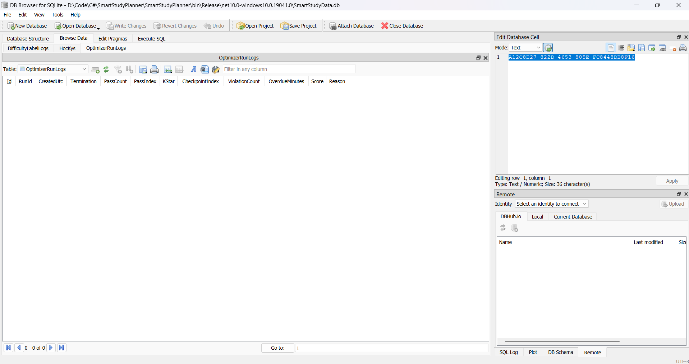

# Owner's GUI test - based on docs
## Observed scenarios - in order
### Group A
#### A1 
 **Expected: Met**
- App starts with no error dialog, no crash, no hang.
- All pre-existing semesters, subjects and tasks are still present and unchanged.
- Study logs / streak / focus history intact.
#### A2 — Fresh database, first launch
 **Expected: Met** app creates a fresh DB, starts to a usable empty state, no error.
#### A3 — Second launch is idempotent
 **Expected: Met** no error; no growing pile of `SmartStudyData.*.bak.db` files appearing on every
launch (a backup is only taken when an upgrade actually runs).

---

### Group B — Telemetry table 
#### B1 — `OptimizerRunLogs` table exists

**Expected: Met** a table named `OptimizerRunLogs` exists, with columns `Id, RunId, CreatedUtc,
Termination, PassCount, PassIndex, KStar, CheckpointIndex, ViolationCount, OverdueMinutes, Score,
Reason`.

#### B2 — `OptimizerRunLogs` is empty, and stays empty

Conditions met, if you cannot open or see the image attached below, notice me later

---

#### C1 — Work packs into the earliest days, densely and contiguously

**Expected (this is the T3.3 change): Met**
- Day cards with work start at **Hôm nay** and run **consecutively** — no empty day sits between
  two days that have work.
- Every day that has work, **except the last one**, is filled to the capacity ceiling (60 phút at
  1 giờ/ngày).
- Only the final used day is partially filled.

**UI bug detected** : when moving the slider the chart re-render once showing one type of schedule, however, when click "Xếp lịch lại" button, the chart re-render once more but with different result. Please note this to the next document for fixing proposal

#### C2 — Capacity slider changes density, not the packing rule

**Expected: Met** at every setting, the C1 shape still holds (contiguous prefix; all but the last used
day at the ceiling). Higher capacity ⇒ fewer, fatter days. No day ever exceeds the ceiling shown
next to the slider.

#### C3 — Slider bounds 
works fine, no comment

#### C4 — Task ordering is still by priority
expected behavior met

#### C5 — Split tasks are labelled
expected behavior met

#### C6 — Completed tasks never appear
expected behavior met

#### C7 — ⚠ Header text vs. observed behaviour — **known finding, please rule on it**
My recommendation: Keep it as-is for user, just edit the infomation note at the bottom of the page, which briefly explain the mechanism (keep it simple for users - no technical terms needed) 

---

### Group D — Edge cases

#### D1 — No tasks at all

expected behavior met

#### D2 — Tasks that have never been scored elsewhere

**Note**: when a task is created, its priority score is immediately calculated and shown in the task list below in the same UI. Nothing concerning about this.  

#### D3/4/5

expected behavior met

---

### Group E — Regression outside SOE

There is no UI that allows managing semesters. Mark this as a proposal for improvement